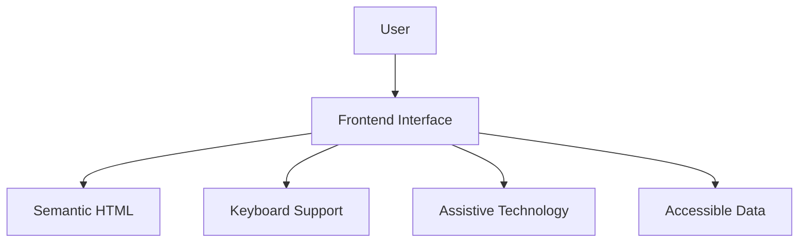

# ACCESSIBILITY CHECKLIST

> Project: Fardad Handicraft E-Commerce Platform

> Version: 1.0

> Status: Active

> Last Updated: 2026-07-19

> Owner: Software Architecture Team

---

# 1. Purpose

This document defines accessibility requirements for the Fardad platform.

The objective is to ensure that:

- All users can interact with the platform.
- User experience remains consistent.
- Accessibility standards are considered from the beginning.
- The application follows modern web accessibility principles.

---

# 2. Accessibility Standard

The platform follows:

## WCAG 2.2

Target level:

```
AA Compliance
```

---

# 3. Accessibility Principles

The system follows four WCAG principles:

```
Perceivable

Operable

Understandable

Robust

```

---

# 4. Accessibility Architecture



---

# 5. RTL Persian Support

The platform must support:

- Full RTL layout
- Persian typography
- Persian numerals where required
- Correct text alignment
- Proper icon positioning

---

# 6. Typography Accessibility

Requirements:

- Readable font family
- Appropriate font size
- Clear hierarchy
- Sufficient line spacing

Avoid:

- Very small text
- Low contrast text
- Decorative fonts for important content

---

# 7. Color and Contrast

Requirements:

All important content must have sufficient contrast.

Check:

- Text
- Buttons
- Links
- Form fields
- Status indicators

---

Luxury design colors:

- Emerald Green
- Matte Gold
- Ivory
- Copper

must maintain readability.

---

# 8. Keyboard Navigation

All interactive elements must support:

- Tab navigation
- Enter activation
- Escape closing

Required:

- Menus
- Modals
- Forms
- Product gallery
- Checkout

---

# 9. Focus Management

Every interactive element requires:

- Visible focus state
- Logical focus order
- No focus traps

---

# 10. Semantic HTML

Use proper elements:

Correct:

```
<header>

<nav>

<main>

<section>

<footer>

<button>

<form>

```

Avoid unnecessary:

```
<div>
```

for interactive elements.

---

# 11. Image Accessibility

Every meaningful image requires:

- Alt text
- Descriptive naming
- Correct context

---

Product image example:

Bad:

```
image123.jpg
```

Good:

```
handmade-turquoise-gift-box.jpg
```

---

Decorative images:

Use:

```
empty alt attribute
```

when appropriate.

---

# 12. Product Page Accessibility

Product pages must support:

- Image descriptions
- Product information hierarchy
- Accessible price display
- Accessible purchase button

---

# 13. Form Accessibility

All forms require:

- Labels
- Error messages
- Validation feedback
- Clear instructions

---

Required forms:

- Login
- Registration
- Checkout
- Corporate registration
- Product management

---

# 14. Checkout Accessibility

Checkout must provide:

- Clear steps
- Visible progress
- Error guidance
- Accessible payment selection

---

# 15. Button Accessibility

Buttons must:

- Describe their action clearly
- Have sufficient size
- Support keyboard interaction

Examples:

Good:

```
Add product to cart
```

Bad:

```
Click here
```

---

# 16. Navigation Accessibility

Navigation must provide:

- Clear menu structure
- Breadcrumb navigation
- Mobile accessible menu

---

# 17. Search Accessibility

Search component requires:

- Accessible input label
- Keyboard support
- Clear results

---

# 18. Dashboard Accessibility

Admin dashboard requires:

- Accessible tables
- Chart alternatives
- Keyboard navigation
- Clear status indicators

---

# 19. Table Accessibility

Tables must include:

- Proper headers
- Row relationships
- Sort indicators

Used in:

- Orders
- Products
- Reports
- Customers

---

# 20. Dynamic Content Accessibility

Dynamic updates require:

Examples:

- Cart update
- Notifications
- Validation messages

Should use:

Accessible announcements.

---

# 21. Mobile Accessibility

Mobile requirements:

- Touch-friendly controls
- Readable text
- Proper spacing
- Responsive layouts

---

# 22. Screen Reader Support

Required:

- Meaningful labels
- ARIA attributes where necessary
- Logical reading order

---

# 23. ARIA Usage Rules

ARIA should:

- Improve accessibility
- Not replace semantic HTML

Avoid unnecessary ARIA.

---

# 24. Error Handling Accessibility

Errors must provide:

- Clear explanation
- Solution guidance
- Visual indication
- Text alternative

---

# 25. Accessibility Testing

Required tests:

## Automated Testing

Check:

- HTML structure
- Contrast
- Missing labels
- Missing alt text


## Manual Testing

Check:

- Keyboard navigation
- Screen reader behavior
- Mobile interaction

---

# 26. Accessibility Tools

Recommended:

- Lighthouse Accessibility Audit
- Browser Accessibility Tools
- Screen Reader Testing

---

# 27. Development Rules

Developers must:

- Consider accessibility during component creation.
- Avoid inaccessible custom controls.
- Test important user flows.

---

# 28. Accessibility Checklist Before Release

## Pages

☐ Homepage tested

☐ Product pages tested

☐ Checkout tested

☐ Account panel tested

☐ Dashboard tested


## Components

☐ Buttons accessible

☐ Forms accessible

☐ Images have alt text

☐ Navigation accessible


## Mobile

☐ Touch targets verified

☐ Responsive layout verified

---

# 29. Future Improvements

Possible additions:

- Voice navigation support
- Advanced screen reader optimization
- Accessibility preference settings

---

# 30. Success Criteria

Accessibility is successful when:

- Users can complete tasks independently.
- Navigation is predictable.
- Content is understandable.
- Interface works across devices.

---

# Action Items

- Include accessibility review in every milestone.
- Test new components before release.
- Maintain WCAG AA compliance.
- Document accessibility decisions.
- Link accessibility improvements to Work Orders.