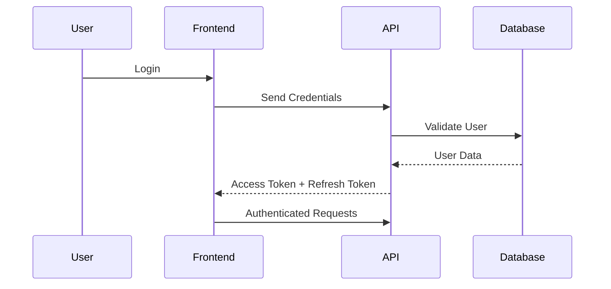
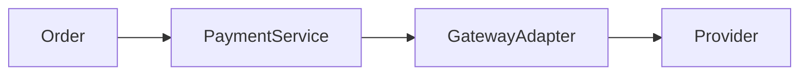

# API ARCHITECTURE

> Project: Fardad Handicraft E-Commerce Platform

> Version: 1.0

> Status: Active

> Last Updated: 2026-07-19

> Owner: Software Architecture Team

---

# 1. Purpose

This document defines the API architecture of the Fardad platform.

The API layer is responsible for communication between:

- Frontend Application
- Admin Dashboard
- Mobile Applications (Future)
- External Services
- Internal Modules

---

# 2. API Architecture Principles

The API must be:

- Secure
- Predictable
- Versioned
- Documented
- Scalable
- Backward compatible

---

# 3. API Style

## Selected Style

REST API

---

## Reason

REST provides:

- Simplicity
- Wide adoption
- Easy integration
- Compatibility with external services

---

# 4. Base API Structure

All APIs use versioning.

Example:

```
/api/v1/products
```

Structure:

```
/api

    /v1

        /resource

```

---

# 5. HTTP Methods

| Method | Usage |
|---|---|
|GET|Retrieve data|
|POST|Create resource|
|PATCH|Update resource|
|DELETE|Remove resource|

---

# 6. Authentication Architecture

Authentication flow:



---

# 7. Authentication Endpoints

## Register

```
POST /api/v1/auth/register
```

Request:

```json
{
"name":"",
"email":"",
"password":""
}
```

---

## Login

```
POST /api/v1/auth/login
```

Response:

```json
{
"accessToken":"",
"refreshToken":"",
"user":{}
}
```

---

## Refresh Token

```
POST /api/v1/auth/refresh
```

---

## Logout

```
POST /api/v1/auth/logout
```

---

# 8. User API

## Current User

```
GET /api/v1/users/me
```

---

## Update Profile

```
PATCH /api/v1/users/me
```

---

# 9. Product API

## Product List

```
GET /api/v1/products
```

Supports:

Filtering

Sorting

Pagination

Search

Example:

```
?page=1

&limit=20

&category=turquoise

&sort=price
```

---

## Product Details

```
GET /api/v1/products/{id}
```

---

## Create Product

Admin only:

```
POST /api/v1/products
```

---

## Update Product

```
PATCH /api/v1/products/{id}
```

---

## Delete Product

```
DELETE /api/v1/products/{id}
```

---

# 10. Category API

## Category List

```
GET /api/v1/categories
```

---

## Category Details

```
GET /api/v1/categories/{slug}
```

---

# 11. Cart API

## View Cart

```
GET /api/v1/cart
```

---

## Add Item

```
POST /api/v1/cart/items
```

---

## Update Quantity

```
PATCH /api/v1/cart/items/{id}
```

---

## Remove Item

```
DELETE /api/v1/cart/items/{id}
```

---

# 12. Order API

## Create Order

```
POST /api/v1/orders
```

---

## Customer Orders

```
GET /api/v1/orders/my
```

---

## Order Details

```
GET /api/v1/orders/{id}
```

---

## Admin Order Management

```
GET /api/v1/admin/orders
```

---

# 13. Payment API

Payment uses Adapter Pattern.

Architecture:



---

## Start Payment

```
POST /api/v1/payment/create
```

---

## Payment Callback

```
POST /api/v1/payment/callback
```

---

## Payment Status

```
GET /api/v1/payment/{orderId}
```

---

# 14. Shipping API

Shipping providers are abstracted.

Supported:

- Iran Post
- Tipax
- Future providers

---

## Calculate Shipping

```
POST /api/v1/shipping/calculate
```

Request:

```json
{
"address":"",
"items":[]
}
```

---

## Track Shipment

```
GET /api/v1/shipping/{orderId}
```

---

# 15. Invoice API

## Generate Invoice

```
POST /api/v1/invoices/create
```

---

## Download Invoice

```
GET /api/v1/invoices/{id}/download
```

---

Supported:

- Individual invoice
- Corporate invoice

---

# 16. Corporate Customer API

## Company Registration

```
POST /api/v1/corporate/register
```

---

## Company Profile

```
GET /api/v1/corporate/profile
```

---

## Corporate Orders

```
GET /api/v1/corporate/orders
```

---

# 17. Media API

## Upload Image

```
POST /api/v1/media/upload
```

Pipeline:

Upload

↓

Validation

↓

Optimization

↓

Storage

↓

Metadata

---

## Media List

```
GET /api/v1/media
```

---

# 18. SEO API

Admin:

```
GET /api/v1/seo/{entity}/{id}
```

Update:

```
PATCH /api/v1/seo/{entity}/{id}
```

---

# 19. Dashboard API

Dashboard provides business intelligence.

---

## Overview

```
GET /api/v1/dashboard/overview
```

Returns:

- Sales
- Orders
- Users
- Visitors

---

## Product Analytics

```
GET /api/v1/dashboard/products
```

Includes:

- Views
- Sales
- Conversion

---

## Content Analytics

```
GET /api/v1/dashboard/content
```

Includes:

- Article views
- Page views

---

## Audit Logs

```
GET /api/v1/dashboard/audit
```

---

# 20. Notification API

Internal service.

Events:

- Registration
- Login code
- Order created
- Payment success
- Shipping update


Endpoint:

```
POST /api/v1/notifications/send
```

---

# 21. Standard Response Format

Successful response:

```json
{
"success":true,
"data":{},
"meta":{}
}
```

---

Error response:

```json
{
"success":false,
"error":{
"code":"",
"message":""
}
}
```

---

# 22. Pagination Standard

Request:

```
?page=1&limit=20
```

Response:

```json
{
"items":[],
"page":1,
"total":100
}
```

---

# 23. Error Handling

Standard HTTP codes:

|Code|Meaning|
|-|-|
|200|Success|
|201|Created|
|400|Validation Error|
|401|Unauthorized|
|403|Forbidden|
|404|Not Found|
|409|Conflict|
|500|Server Error|

---

# 24. API Security

Mandatory:

- Authentication
- Authorization
- Input validation
- Rate limiting
- Request logging
- Secure headers
- API monitoring

---

# 25. API Documentation

Required:

OpenAPI / Swagger documentation.

Every endpoint must define:

- Request schema
- Response schema
- Authentication requirement
- Error responses

---

# 26. API Performance

Requirements:

- Pagination required for lists.
- Avoid returning unnecessary fields.
- Use caching where needed.
- Optimize database queries.

---

# 27. API Success Criteria

API architecture is successful when:

- Frontend can consume all required services.
- External providers can integrate safely.
- New modules can be added without breaking existing clients.
- Security requirements are satisfied.

---

# Action Items

- Maintain API documentation with every change.
- Update API architecture after adding new modules.
- Link API changes to Work Orders and ADR records.
- Validate every endpoint before production release.