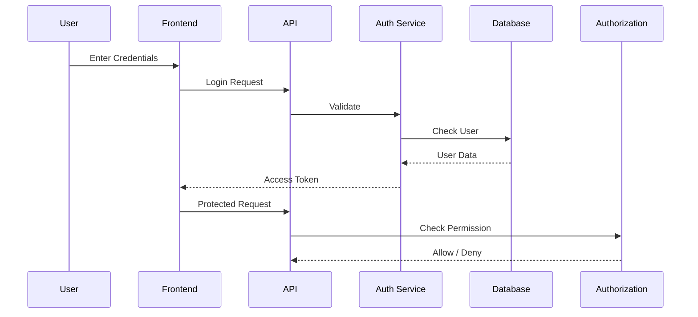
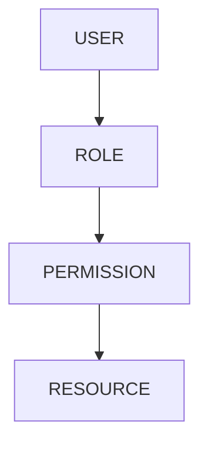
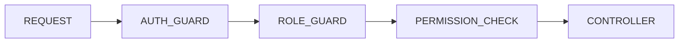

# AUTHENTICATION & AUTHORIZATION DESIGN

> Project: Fardad Handicraft E-Commerce Platform

> Version: 1.0

> Status: Active

> Last Updated: 2026-07-19

> Owner: Software Architecture Team

---

# 1. Purpose

This document defines the authentication and authorization architecture of the Fardad platform.

The objective is to provide:

- Secure user identity management
- Role-based access control
- Permission management
- Protected business operations
- Auditability

---

# 2. Security Model

The platform uses:

## Authentication

Identity verification.

Question:

"Who is the user?"

---

## Authorization

Permission verification.

Question:

"What is the user allowed to do?"

---

# 3. Authentication Architecture

Authentication flow:



---

# 4. User Types

The system supports:

| Role | Description |
|-|-|
|Customer|Individual buyer|
|Corporate Customer|Organization buyer|
|Administrator|Full system access|
|Sales Manager|Sales operations|
|Order Operator|Order processing|
|Content Manager|Articles and pages|
|SEO Manager|SEO management|
|Analytics Manager|Reports and dashboards|

---

# 5. Authentication Methods

Supported methods:

## Email / Password

For:

- Customers
- Administrators


---

## Mobile OTP

Recommended for:

- Customer login
- Purchase verification


Flow:

```
Mobile Number

↓

OTP Generation

↓

SMS Delivery

↓

Verification

↓

Login

```

---

# 6. Token Architecture

Authentication uses:

## Access Token

Purpose:

Short-term API access.

---

## Refresh Token

Purpose:

Session renewal.

---

Rules:

- Access tokens expire quickly.
- Refresh tokens are securely stored.
- Logout invalidates refresh tokens.

---

# 7. Password Security

Requirements:

- Password hashing
- Strong password policy
- Failed login protection
- Password reset workflow

Never store:

```
Plain Password
```

---

# 8. Role Based Access Control (RBAC)

The system uses RBAC.

Structure:



---

Example:

User:

```
Ali
```

Role:

```
Sales Manager
```

Permissions:

```
order.view

order.update

customer.view

```

---

# 9. Permission Structure

Permission naming:

```
module.action
```

Examples:

```
product.create

product.update

product.delete


order.view

order.manage


report.view

seo.manage

```

---

# 10. Permission Domains

## Product Permissions

```
product.create

product.edit

product.delete

product.publish

```

---

## Order Permissions

```
order.view

order.update

order.cancel

order.refund

```

---

## Customer Permissions

```
customer.view

customer.update

customer.export

```

---

## Content Permissions

```
content.create

content.edit

content.publish

```

---

## SEO Permissions

```
seo.view

seo.edit

seo.publish

```

---

## Dashboard Permissions

```
dashboard.view

analytics.view

report.export

```

---

# 11. Role Matrix

| Permission | Customer | Corporate | Sales | Admin |
|-|-|-|-|-|
|View Products|✓|✓|✓|✓|
|Create Order|✓|✓|✓|✓|
|Manage Orders|-|-|✓|✓|
|Manage Products|-|-|-|✓|
|View Reports|-|-|Limited|✓|
|Manage Users|-|-|-|✓|

---

# 12. Customer Authorization

Customer can:

- Manage profile
- Manage addresses
- View orders
- Download invoices
- Track shipping
- Manage favorites

Customer cannot:

- Access admin
- View other customers
- Modify prices

---

# 13. Corporate Customer Authorization

Additional capabilities:

- Company profile
- Legal information
- Corporate orders
- Official invoices
- Bulk purchase requests

---

# 14. Admin Authorization

Administrator has:

- Full access
- User management
- Permission management
- System configuration
- Reports

---

# 15. Protected Routes

Frontend:

Examples:

```
/dashboard

/admin

/account/orders

```

Backend:

All protected APIs require:

- Valid token
- Permission verification

---

# 16. Middleware Architecture



---

# 17. Audit Requirements

Security-sensitive actions must be logged.

Examples:

- Login
- Failed login
- Permission changes
- Product price changes
- User deletion

Log contains:

```
User ID

Action

Timestamp

IP

Device

Result

```

---

# 18. Account Security

Required:

- Login attempt monitoring
- Account lock protection
- Session management
- Password reset security

---

# 19. Corporate Verification

Corporate accounts require:

Information:

- Company name
- Registration number
- Economic code
- Official contact

Verification status:

```
Pending

Approved

Rejected

```

---

# 20. Security Rules

Mandatory:

- Never trust frontend permissions.
- Backend must verify every action.
- Sensitive operations require authorization.
- All admin actions must be audited.

---

# 21. Testing Requirements

Authentication tests:

- Login success
- Login failure
- Token expiration
- Password reset


Authorization tests:

- Allowed access
- Forbidden access
- Role changes
- Permission changes

---

# 22. Future Expansion

Possible additions:

- Two-factor authentication
- Social login
- SSO for organizations
- Advanced identity management

---

# 23. Success Criteria

Authentication and authorization are successful when:

- Users access only permitted resources.
- Business operations are protected.
- Security events are traceable.
- New roles can be added easily.

---

# Action Items

- Implement RBAC before building admin modules.
- Maintain permission documentation.
- Audit all sensitive operations.
- Review security rules before every major release.
- Link permission changes to Work Orders.