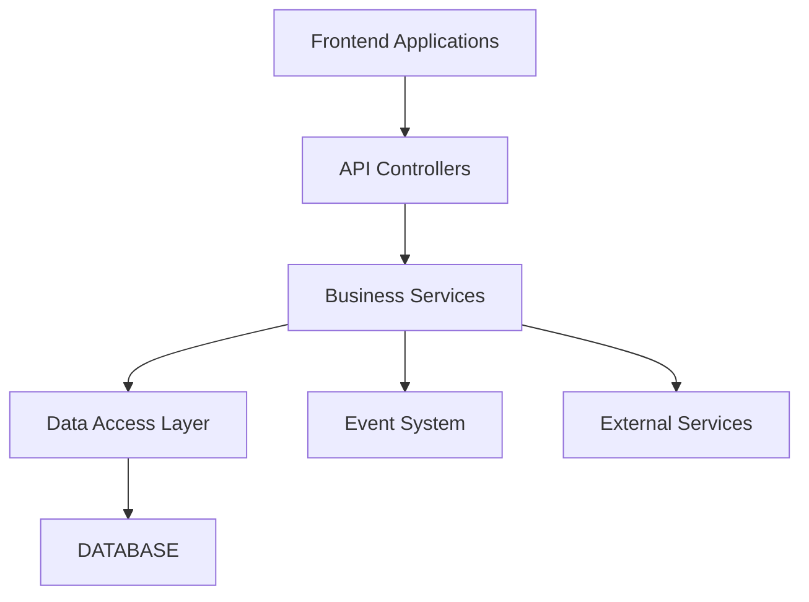
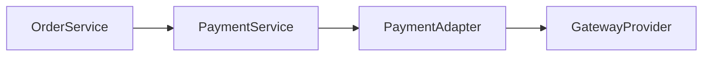
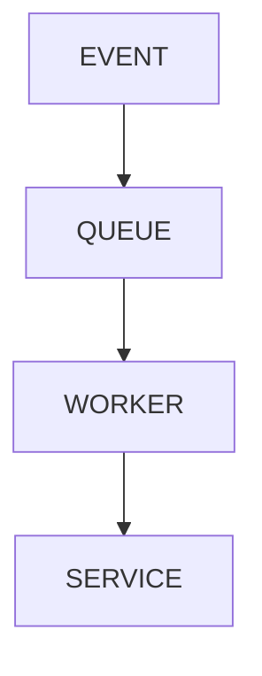

# BACKEND ARCHITECTURE

> Project: Fardad Handicraft E-Commerce Platform

> Version: 1.0

> Status: Active

> Last Updated: 2026-07-19

> Owner: Software Architecture Team

---

# 1. Purpose

This document defines the backend architecture of the Fardad platform.

The backend is responsible for:

- Business logic
- Data management
- Authentication
- Authorization
- Commerce operations
- External integrations
- Reporting
- Security
- Background processing

---

# 2. Backend Technology

## Recommended Framework

NestJS

---

## Language

TypeScript

---

## Database

PostgreSQL

---

## ORM

Recommended:

Prisma ORM

---

## API Style

REST API

Versioned:

```
/api/v1
```

---

# 3. Backend Architecture Style

## Selected Pattern

Modular Monolith Architecture

---

Reason:

- Suitable for current business scale
- Fast development
- Strong separation
- Easy future migration to microservices

---

# 4. Backend Architecture Principles

Mandatory rules:

- Each module owns its business logic.
- Controllers must remain thin.
- Services contain business rules.
- Database access is isolated.
- External providers use adapters.
- Cross-cutting concerns are centralized.

---

# 5. High Level Backend Architecture



---

# 6. Backend Folder Structure

Recommended:

```
backend/

src/

├── modules/

│   ├── auth/

│   ├── users/

│   ├── customers/

│   ├── products/

│   ├── categories/

│   ├── inventory/

│   ├── cart/

│   ├── orders/

│   ├── payments/

│   ├── shipping/

│   ├── invoices/

│   ├── media/

│   ├── seo/

│   ├── notifications/

│   ├── analytics/

│   └── audit/


├── common/

│   ├── guards/

│   ├── interceptors/

│   ├── filters/

│   ├── decorators/

│   └── validators/


├── database/

├── config/

├── jobs/

├── events/

└── main.ts

```

---

# 7. Module Architecture

Each module follows:

```
module/

├── controller.ts

├── service.ts

├── repository.ts

├── dto/

├── entities/

├── validators/

└── tests/

```

---

# 8. Core Modules

---

# 8.1 Authentication Module

Responsibilities:

- Login
- Registration
- Password management
- Token management
- Session control

Components:

```
AuthController

AuthService

TokenService

PasswordService

```

---

# 8.2 User Management Module

Responsibilities:

- User profiles
- Roles
- Permissions

---

# 8.3 Product Module

Responsibilities:

- Product CRUD
- Categories
- Attributes
- Pricing
- Product status

---

# 8.4 Inventory Module

Responsibilities:

- Stock management
- Availability
- Reservation

---

# 8.5 Order Module

Responsibilities:

- Cart conversion
- Order creation
- Order lifecycle

Order states:

```
Created

↓

Pending Payment

↓

Paid

↓

Processing

↓

Shipped

↓

Completed

```

---

# 8.6 Payment Module

Payment uses Adapter Pattern.



Supported providers:

- Iranian gateways
- Future providers

---

# 8.7 Shipping Module

Shipping providers are abstracted.

Architecture:

```
ShippingService

↓

ShippingAdapter

↓

Provider

```

Examples:

- Iran Post
- Tipax

---

# 8.8 Invoice Module

Responsibilities:

- Customer invoices
- Corporate invoices
- PDF generation

Supports:

Individual:

- Name
- Address
- Contact


Corporate:

- Company name
- Registration number
- Economic code
- Legal information

---

# 8.9 Media Module

Responsibilities:

- Upload handling
- Image processing
- Storage management

Pipeline:


---

# 8.10 SEO Module

Responsibilities:

- Metadata management
- Schema generation
- Sitemap data

---

# 8.11 Notification Module

Central service for:

- SMS
- Email
- Internal notifications

Events:

- Registration
- Login verification
- Purchase
- Payment
- Shipping

---

# 8.12 Analytics Module

Collects:

- Page views
- Product views
- Orders
- Conversion
- User behavior

---

# 8.13 Audit Module

Tracks:

- User actions
- Admin actions
- Security events

Example:

```
User changed product price

Timestamp

IP

User ID

```

---

# 9. Service Layer Rules

Services:

Must:

- Contain business logic.
- Validate business rules.
- Coordinate repositories.

Must not:

- Handle HTTP directly.
- Manage UI concerns.

---

# 10. Repository Layer Rules

Repositories handle:

- Database queries
- Transactions
- Data retrieval

Controllers never access database directly.

---

# 11. Background Jobs

Required for:

- Image processing
- Email sending
- SMS sending
- Reports generation
- Data synchronization

Architecture:



---

# 12. Event Driven Architecture

Important events:

```
UserRegistered

OrderCreated

PaymentCompleted

ShipmentUpdated

ProductUpdated

```

Events trigger:

- Notifications
- Analytics
- Audit logs

---

# 13. Validation Strategy

Every external input requires:

- DTO validation
- Type checking
- Business validation

---

# 14. Error Handling

Centralized exception handling.

Standard format:

```json
{
"success":false,
"error":{
"code":"",
"message":""
}
}
```

---

# 15. Logging Strategy

Required logs:

- Errors
- Security events
- Important business events

Never log:

- Passwords
- Tokens
- Sensitive payment data

---

# 16. Security Architecture

Mandatory:

- Authentication guards
- Permission guards
- Rate limiting
- Input sanitization
- Secure headers
- Secret management

---

# 17. Performance Strategy

Backend optimization:

- Database indexing
- Query optimization
- Caching
- Background jobs
- Pagination

---

# 18. Testing Strategy

Required:

## Unit Tests

Services

Validators

Business rules


## Integration Tests

Database

API

External adapters


## End-to-End Tests

Complete customer journeys

---

# 19. Deployment Considerations

Backend deployment requires:

- Environment variables
- Database connection
- Storage configuration
- Logging
- Monitoring

---

# 20. Future Scalability

Potential service extraction:

- Search Service
- Media Service
- Notification Service
- Analytics Service

---

# 21. Backend Success Criteria

Backend is successful when:

- Business logic is isolated.
- New features can be added safely.
- Security requirements are satisfied.
- Performance remains stable.
- Multiple developers can work independently.

---

# Action Items

- Keep module boundaries strict.
- Document major backend decisions.
- Update architecture after major changes.
- Link backend changes to Work Orders.
- Review before implementation milestones.