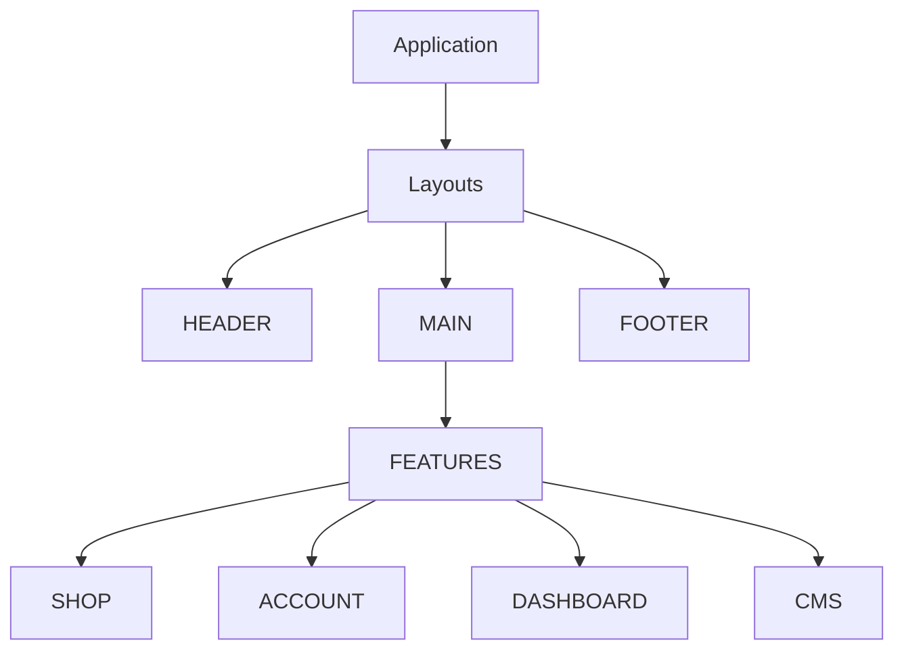
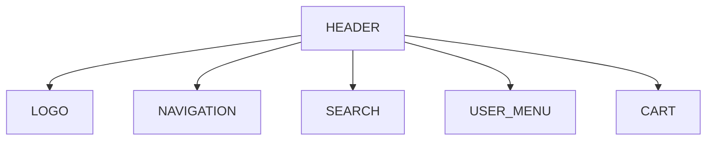
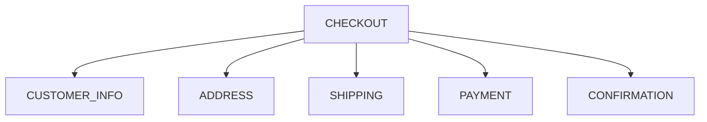
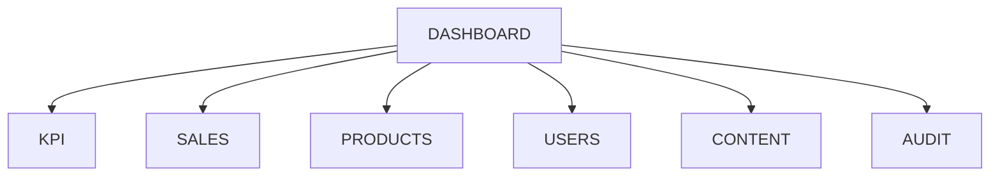

# COMPONENT HIERARCHY

> Project: Fardad Handicraft E-Commerce Platform

> Version: 1.0

> Status: Active

> Last Updated: 2026-07-19

> Owner: Software Architecture Team

---

# 1. Purpose

This document defines the frontend component hierarchy of the Fardad platform.

The goal is to create:

- Reusable components
- Consistent UI
- Maintainable frontend structure
- Clear component ownership

---

# 2. Component Architecture Principles

Components must follow:

- Single responsibility
- Reusability
- Clear ownership
- Minimal dependencies
- Business separation

---

# 3. Component Layers

Frontend components are divided into five layers:

```
UI Components

↓

Shared Components

↓

Feature Components

↓

Page Components

↓

Application Layouts

```

---

# 4. Global Component Tree



---

# 5. Application Layout Components

Location:

```
components/layout
```

---

## RootLayout

Responsibilities:

- Global providers
- Theme
- Fonts
- RTL configuration
- Metadata

---

## PublicLayout

Used for:

- Homepage
- Products
- Articles
- Landing pages


Contains:

```
Header

Navigation

Main Content

Footer

```

---

## ShopLayout

Used for:

- Product browsing
- Cart
- Checkout


---

## AccountLayout

Used for:

- Customer dashboard
- Orders
- Profile


---

## AdminLayout

Used for:

- Management dashboard
- Reports
- Content management

---

# 6. Header Components

Structure:



---

Components:

```
Logo

MainNavigation

CategoryMenu

SearchBox

UserMenu

CartIcon

```

---

# 7. Product Components

Location:

```
features/products/components
```

---

## ProductCard

Displays:

- Image
- Name
- Price
- Badge
- Quick action


---

## ProductGallery

Contains:

```
MainImage

ThumbnailList

ZoomViewer

```

---

## ProductInformation

Contains:

```
Title

Description

Specifications

Price

Availability

```

---

## ProductActions

Contains:

```
QuantitySelector

AddToCartButton

FavoriteButton

```

---

## ProductReviews

Contains:

```
ReviewList

ReviewForm

Rating

```

---

# 8. Shopping Cart Components

Location:

```
features/cart/components
```

---

Components:

```
CartList

CartItem

CartSummary

DiscountBox

CheckoutButton

```

---

# 9. Checkout Components

Location:

```
features/checkout/components
```

---

Structure:



---

Components:

```
CustomerInformationForm

AddressSelector

ShippingSelector

PaymentSelector

OrderSummary

```

---

# 10. Customer Account Components

Location:

```
features/account/components
```

---

Components:

```
ProfileCard

AddressManager

OrderHistory

InvoiceList

FavoriteProducts

```

---

# 11. Corporate Customer Components

Location:

```
features/corporate/components
```

---

Components:

```
CompanyProfile

LegalInformationForm

CorporateOrderForm

CorporateInvoiceViewer

```

---

# 12. Dashboard Components

Location:

```
features/dashboard/components
```

---

Main structure:



---

## KPI Components

```
RevenueCard

OrderCountCard

VisitorCard

ConversionCard

```

---

## Analytics Components

```
SalesChart

VisitorChart

ProductPerformanceTable

TrafficSourceChart

```

---

# 13. Product Management Components

Admin:

```
ProductTable

ProductEditor

ImageUploader

InventoryManager

CategorySelector

SEOEditor

```

---

# 14. Media Components

Location:

```
features/media/components
```

---

Components:

```
MediaUploader

ImageCropper

ImagePreview

GalleryManager

MediaLibrary

```

---

# 15. SEO Components

Location:

```
features/seo/components
```

---

Components:

```
MetaEditor

SchemaEditor

PreviewCard

SEOScore

```

---

# 16. CMS Components

Components:

```
PageEditor

ArticleEditor

ContentBlock

MenuManager

```

---

# 17. Shared UI Components

Location:

```
components/ui
```

---

Basic components:

```
Button

Input

Select

Modal

Dropdown

Card

Table

Badge

Alert

Tooltip

Pagination

```

---

# 18. Form Components

All forms must support:

- Validation
- Error state
- Loading state
- Success state

Common:

```
FormField

FormError

SubmitButton

```

---

# 19. Component Dependency Rules

Allowed:

```
Page

↓

Feature Component

↓

Shared Component

↓

UI Component

```

---

Forbidden:

```
UI Component

↓

Business Component

```

---

Example:

Wrong:

```
Button

imports Product Service

```

Correct:

```
Product Component

uses

Button

```

---

# 20. Component Naming Rules

Use:

PascalCase

Examples:

Correct:

```
ProductCard

OrderTable

```

Incorrect:

```
product_card

order-table

```

---

# 21. Component Testing Rules

Important components require:

- Unit tests
- Interaction tests
- Visual verification

---

Priority components:

High:

- ProductCard
- Cart
- Checkout
- Payment
- Dashboard widgets

Medium:

- Tables
- Forms

Low:

- Decorative components

---

# 22. Performance Rules

Components should:

- Avoid unnecessary rendering
- Use lazy loading when needed
- Optimize images
- Avoid large client components

---

# 23. Accessibility Rules

Components must support:

- Keyboard navigation
- Screen readers
- Focus management
- Semantic HTML

---

# 24. Component Success Criteria

The component architecture is successful when:

- UI remains consistent.
- New pages can reuse existing components.
- Development speed increases.
- Maintenance cost decreases.

---

# Action Items

- Follow this hierarchy during implementation.
- Create new components only when responsibility is clear.
- Avoid duplicated UI logic.
- Update this document when major components are added.
- Link large component decisions to ADR documents.