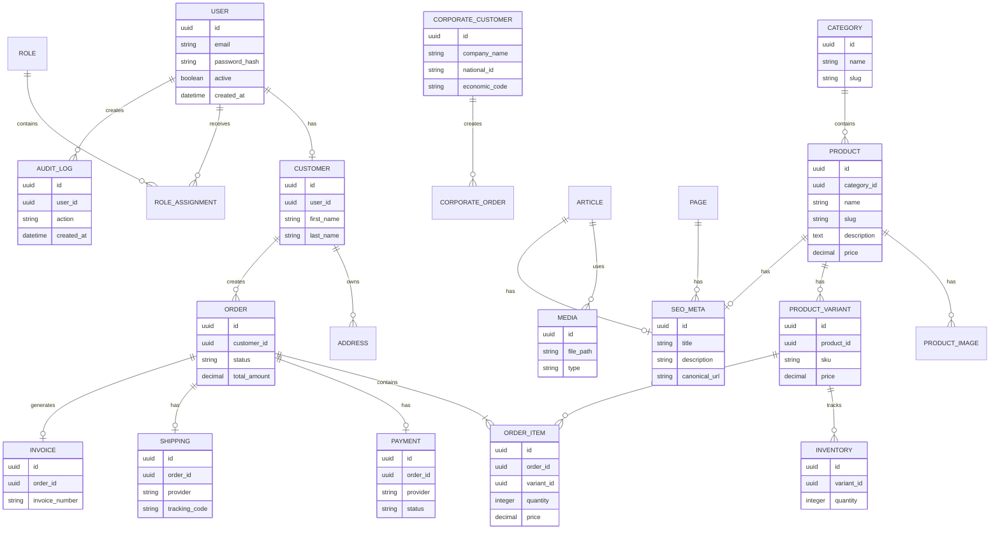

# DATABASE ARCHITECTURE

> Project: Fardad Handicraft E-Commerce Platform

> Version: 1.0

> Status: Active

> Last Updated: 2026-07-19

> Owner: Software Architecture Team

---

# 1. Purpose

This document defines the database architecture of the Fardad platform.

The database design must support:

- E-commerce operations
- Corporate sales
- Customer management
- Product management
- Content management
- Analytics
- Reporting
- Security auditing

---

# 2. Database Technology

## Primary Database

PostgreSQL

---

## Reason

Selected because of:

- Strong relational model
- Transaction reliability
- Advanced indexing
- JSON support
- Scalability
- Enterprise adoption

---

# 3. Database Design Principles

The database follows:

- Normalized relational design
- Clear entity ownership
- Foreign key integrity
- Transaction consistency
- Auditability
- Performance-oriented indexing

---

# 4. Main Database Domains

The database is divided into logical domains:

```
Authentication

Customer

Commerce

Order

Payment

Shipping

Invoice

CMS

Media

SEO

Analytics

Audit
```

---

# 5. Entity Relationship Diagram



---

# 6. Authentication Tables

## users

Stores all system users.

Fields:

- id
- email
- password_hash
- status
- created_at
- updated_at


---

## roles

Defines permissions groups.

Examples:

- Admin
- Manager
- Customer
- Content Manager

---

## permissions

Defines system capabilities.

Examples:

- product.create
- order.manage
- report.view

---

# 7. Customer Domain

## customers

Stores individual customers.

Includes:

- Personal information
- Contact information
- Account relationship


---

## corporate_customers

Stores organization customers.

Required fields:

- Company name
- Registration number
- Economic code
- Tax information
- Official address

Purpose:

Support B2B sales.

---

# 8. Commerce Domain

## categories

Product grouping.

Supports:

- Nested categories
- SEO URLs
- Landing pages


---

## products

Main product entity.

Contains:

- Name
- Description
- Status
- SEO information


---

## Product Variants

Supports:

- Different sizes
- Different materials
- Different packages
- Different prices


---

## Inventory

Tracks:

- Stock
- Availability
- Reservations

---

# 9. Order Domain

Order lifecycle:

```
Created

↓

Pending Payment

↓

Paid

↓

Processing

↓

Shipped

↓

Completed

```

Possible states:

- Cancelled
- Failed
- Returned

---

# 10. Payment Domain

Payment architecture supports multiple providers.

Table:

payments


Stores:

- Gateway
- Transaction ID
- Amount
- Status
- Response data

---

# 11. Shipping Domain

Supports provider adapters.

Examples:

- Iran Post
- Tipax
- Other providers


Stores:

- Provider
- Cost
- Tracking number
- Status

---

# 12. Invoice Domain

Supports:

## Individual Invoice

Customer:

- Name
- Address
- Contact


## Corporate Invoice

Company:

- Legal name
- Registration data
- Economic code
- Official address


Output:

- PDF invoice
- Printable invoice

---

# 13. Media Domain

Media tables support:

- Product images
- Article images
- Gallery images

Stored metadata:

- Filename
- Size
- Format
- Dimensions
- Alt text
- Optimization status

---

# 14. SEO Domain

SEO data is separated.

Supports:

- Products
- Categories
- Pages
- Articles


Fields:

- Title
- Meta description
- Canonical
- Schema data

---

# 15. Analytics Domain

Stores:

- Page views
- Product views
- Searches
- User activity
- Conversion events


Purpose:

Dashboard reporting.

---

# 16. Audit Log

Every important action must be recorded.

Examples:

- Login
- Product creation
- Price change
- Order update
- Permission change

---

# 17. Index Strategy

Important indexes:

Products:

```
slug

category_id

created_at

status
```

Orders:

```
customer_id

status

created_at
```

Users:

```
email

phone
```

SEO:

```
canonical_url
```

---

# 18. Migration Strategy

All database changes must use migrations.

Rules:

- Never modify production manually.
- Every migration must be reversible.
- Test migrations before release.

---

# 19. Backup Strategy

Required:

Daily backup

Weekly full backup

Restore testing

Backup monitoring

---

# 20. Data Security

Sensitive fields:

- Password hashes
- Personal data
- Corporate information
- Payment references

Protection:

- Encryption where required
- Access control
- Audit logging

---

# 21. Database Success Criteria

Database architecture is successful when:

- Data integrity is maintained.
- Queries remain performant.
- New features can be added safely.
- Reporting requirements are supported.
- Business growth is possible.

---

# Action Items

- Validate schema before implementation.
- Update ERD after major changes.
- Link database changes to ADR and Work Orders.
- Review indexing during performance milestones.