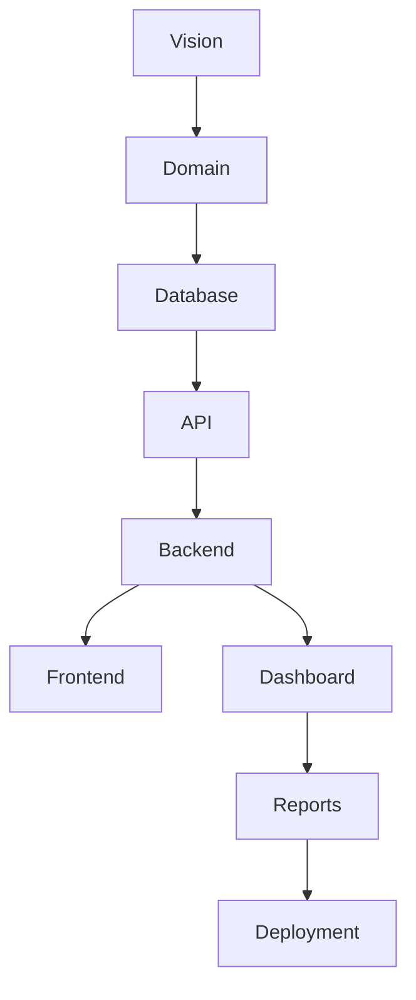
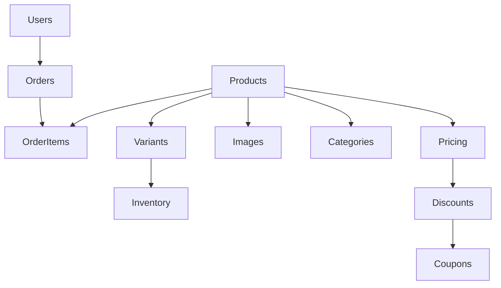

# DEPENDENCY MATRIX

> Project: Fardad Handicraft E-Commerce Platform
>
> Version: 1.0
>
> Status: Active
>
> Last Updated: 2026-07-19

---

# Purpose

This document defines all architectural dependencies between project modules.

Its objectives are:

- Prevent incorrect implementation order
- Avoid circular dependencies
- Help Codex understand module relationships
- Reduce architectural conflicts
- Define implementation prerequisites

Every Work Order MUST respect this document.

---

# Dependency Levels

| Level | Description |
|--------|-------------|
| Core | Foundation modules required by almost everything |
| Domain | Business entities and business logic |
| Commerce | E-commerce business modules |
| Platform | Shared services |
| Presentation | Frontend & Dashboard |
| Infrastructure | Deployment and Operations |

---

# Core Dependency Graph

---

# Module Dependency Matrix

| Module | Depends On |
|----------|------------|
| Authentication | Users |
| Authorization | Authentication |
| Users | Database |
| Roles | Users |
| Permissions | Roles |
| Categories | Database |
| Products | Categories |
| Product Variants | Products |
| Product Images | Products |
| Product Attributes | Products |
| Inventory | Product Variants |
| Pricing | Products |
| Discount Rules | Pricing |
| Coupons | Discount Rules |
| Orders | Users, Products |
| Order Items | Orders |
| Shipping | Orders |
| Payments | Orders |
| Invoice | Orders, Payments |
| Notifications | Orders, Users |
| Dashboard | API |
| Reports | Dashboard |
| CMS | Users |
| Blog | CMS |
| Search | Products, Categories |
| SEO | Products, CMS |
| Media Library | Products, CMS |
| Audit Log | Users |
| Activity Timeline | Audit Log |
| Analytics | Orders, Products |
| Backup | Database |
| Deployment | Backend |

---

# Database Dependencies

---

# API Dependencies

Authentication

↓

Authorization

↓

Validation

↓

Business Logic

↓

Database

↓

Response

---

# Dashboard Dependencies

Dashboard

↓

Analytics

↓

Reports

↓

Charts

↓

Widgets

↓

Notifications

---

# Search Dependencies

Search Engine

↓

Products

↓

Categories

↓

Tags

↓

CMS

↓

SEO

---

# SEO Dependencies

SEO

↓

Products

↓

Categories

↓

Blog

↓

CMS

↓

Media

---

# Media Dependencies

Media Library

↓

Upload

↓

Optimization

↓

WebP

↓

Thumbnail

↓

Responsive Images

↓

CDN

---

# Shipping Dependencies

Shipping

↓

Address

↓

Order

↓

Carrier

↓

Tracking

↓

Notification

---

# Invoice Dependencies

Invoice

↓

Order

↓

Payment

↓

Customer

↓

Company Information

↓

PDF Generator

---

# Reporting Dependencies

Reports

↓

Orders

↓

Products

↓

Users

↓

Inventory

↓

Analytics

---

# Architectural Rules

## Rule 1

A module may only depend on lower architectural layers.

---

## Rule 2

Circular dependencies are strictly prohibited.

---

## Rule 3

Shared functionality must be extracted into reusable services.

---

## Rule 4

Business logic must never exist inside UI components.

---

## Rule 5

Database access must only happen through repositories/services.

---

# Codex Rules

Before implementing any module:

1. Verify dependencies.
2. Verify prerequisite Work Orders.
3. Do not implement modules out of sequence.
4. Never bypass architecture layers.
5. Stop if dependency conflicts exist.

---

# Future Planned Modules

The following modules are reserved for future expansion and are NOT part of the current implementation scope:

- Marketplace
- Multi Vendor
- CRM
- ERP
- Accounting Platform
- Multi Tenant
- Plugin Marketplace

---

# Action Items

- Keep this matrix synchronized with Blueprint chapters.
- Update whenever a new module is introduced.
- Review before creating new Work Orders.
- Validate dependencies before implementation begins.