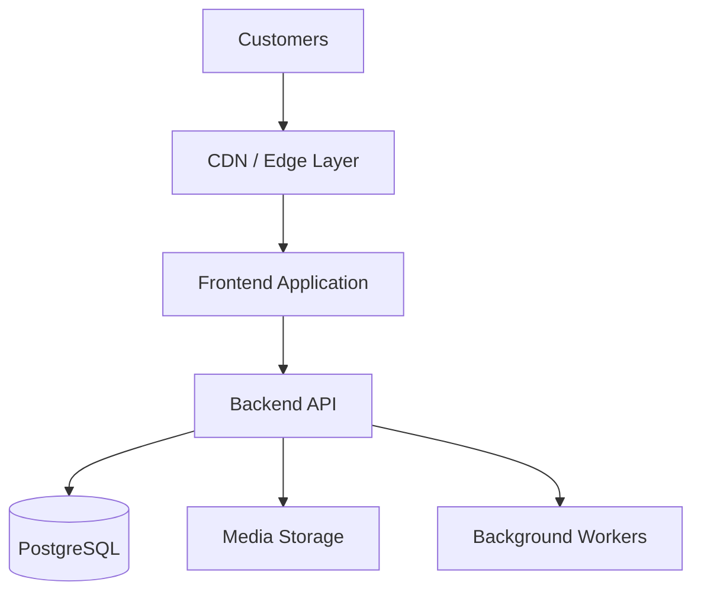
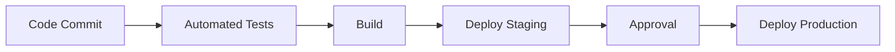
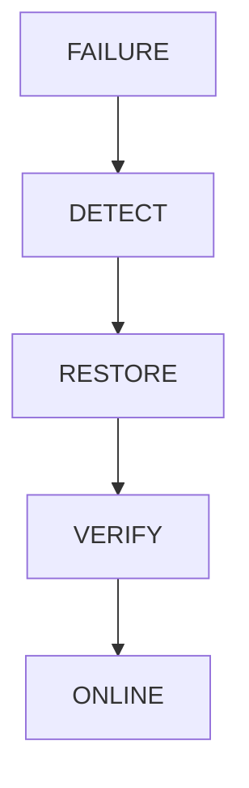

# DEPLOYMENT ARCHITECTURE

> Project: Fardad Handicraft E-Commerce Platform

> Version: 1.0

> Status: Active

> Last Updated: 2026-07-19

> Owner: Software Architecture Team

---

# 1. Purpose

This document defines the deployment architecture of the Fardad platform.

The goal is to provide a reliable production environment that supports:

- E-commerce operations
- Customer access
- Corporate customers
- Admin operations
- Media delivery
- Reporting
- Future scalability

---

# 2. Deployment Principles

The platform deployment follows:

- Environment separation
- Automated deployment
- Secure configuration
- Backup strategy
- Monitoring
- Rollback capability

---

# 3. Deployment Environments

The platform contains three environments:

```
Development

↓

Staging

↓

Production

```

---

# 4. Development Environment

Purpose:

Daily development.

Contains:

- Local frontend
- Local backend
- Development database
- Test storage


Used by:

- Developers
- Codex implementation workflow

---

# 5. Staging Environment

Purpose:

Pre-production verification.

Used for:

- Feature testing
- QA testing
- Client review
- Performance testing

Characteristics:

- Similar to production
- Separate database
- Test payment gateway

---

# 6. Production Environment

Purpose:

Live customer platform.

Contains:

- Public website
- Backend services
- Database
- Media storage
- Monitoring

---

# 7. High Level Deployment Architecture



---

# 8. Frontend Deployment

Frontend responsibilities:

- User interface
- SEO pages
- Product pages
- Customer panels
- Admin interface

Requirements:

- HTTPS
- CDN support
- Environment variables
- Build optimization

---

# 9. Backend Deployment

Backend responsibilities:

- Business logic
- Authentication
- Orders
- Payments
- Integrations

Requirements:

- Secure runtime
- Process management
- Logging
- Health checks

---

# 10. Database Deployment

Database:

Recommended:

```
PostgreSQL
```

Requirements:

- Secure access
- Automated backup
- Migration management
- Index monitoring

---

# 11. Media Storage Deployment

Media requires dedicated storage.

Stores:

- Product images
- Catalog images
- Marketing files
- User documents

Architecture:

```
Application

↓

Media Service

↓

Object Storage

```

---

# 12. Domain Architecture

Recommended:

```
www.fardad.com

Main Website


api.fardad.com

Backend API


admin.fardad.com

Management Panel


media.fardad.com

Media Delivery

```

---

# 13. SSL Security

Required:

- HTTPS everywhere
- Valid certificates
- Secure cookies
- Encrypted communication

---

# 14. Environment Configuration

Sensitive information must use:

Environment variables.

Examples:

```
DATABASE_URL

API_SECRET

PAYMENT_KEY

STORAGE_KEY

```

Never store secrets in source code.

---

# 15. CI/CD Pipeline

Deployment workflow:



---

# 16. Version Management

Every release requires:

- Version number
- Change log
- Migration notes
- Rollback plan

---

# 17. Database Migration Strategy

Rules:

- All changes through migrations.
- Production migrations reviewed.
- Backup before major migration.

---

# 18. Backup Architecture

Backup targets:

## Database

- Daily backup
- Retention policy


## Media

- Regular synchronization


## Configuration

- Secure backup

---

# 19. Disaster Recovery

Recovery plan:



---

# 20. Monitoring Architecture

Monitor:

## Application

- Errors
- Response time
- Availability


## Infrastructure

- CPU
- Memory
- Disk


## Database

- Connections
- Slow queries

---

# 21. Logging Architecture

Central logs include:

- Application errors
- Security events
- Business events

Avoid logging:

- Passwords
- Tokens
- Payment data

---

# 22. Health Checks

Required endpoints:

Example:

```
/health

```

Checks:

- API availability
- Database connection
- Storage connection

---

# 23. Scaling Strategy

Current:

Modular Monolith


Future scaling:

Possible separation:

- Media Service
- Search Service
- Notification Service
- Analytics Service

---

# 24. Deployment Security

Required:

- Firewall
- Restricted access
- SSH security
- Updated dependencies
- Monitoring

---

# 25. Production Launch Checklist

Before launch:

## Infrastructure

☐ Server configured

☐ SSL active

☐ Backup enabled


## Application

☐ Tests passed

☐ Environment variables configured

☐ Database migrated


## Business

☐ Payment tested

☐ Shipping tested

☐ Invoice tested

☐ Customer flow tested

---

# 26. Rollback Strategy

Every deployment must support:

- Previous version restore
- Database recovery plan
- Quick service recovery

---

# 27. Success Criteria

Deployment architecture is successful when:

- Platform remains available.
- Updates can be released safely.
- Failures can be recovered quickly.
- Infrastructure can scale with business growth.

---

# Action Items

- Maintain deployment documentation.
- Test backup restoration periodically.
- Review infrastructure before production launch.
- Document every release.
- Link deployment changes to Work Orders.