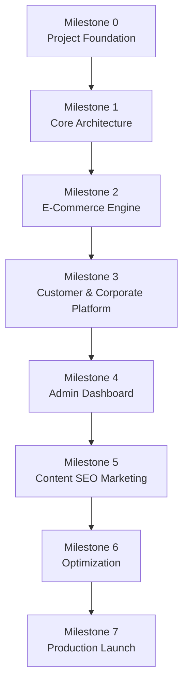
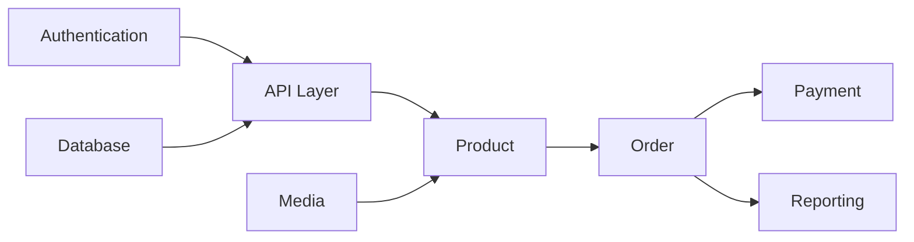

# DEVELOPMENT ROADMAP

> Project: Fardad Handicraft E-Commerce Platform

> Version: 1.0

> Status: Active

> Last Updated: 2026-07-19

> Owner: Software Architecture Team

---

# 1. Purpose

This document defines the development roadmap for the Fardad platform.

The objective is to transform the approved architecture into an executable implementation plan.

The roadmap defines:

- Development phases
- Milestones
- Dependencies
- Priorities
- Delivery order

---

# 2. Development Strategy

The project follows an incremental development approach.

Strategy:

```
Foundation

↓

Core Platform

↓

Business Modules

↓

Optimization

↓

Production

```

---

# 3. Development Principles

Implementation must:

- Follow Blueprint documents.
- Avoid premature optimization.
- Build core dependencies first.
- Deliver usable features incrementally.

---

# 4. Project Milestones Overview



---

# 5. Milestone 0 - Project Foundation

## Goal

Prepare technical foundation.

---

## Tasks

- Repository setup
- Branch strategy
- Development environment
- Base project structure
- Environment configuration
- Documentation structure

---

## Deliverables

```
Repository Ready

Development Environment Ready

CI/CD Foundation

```

---

# 6. Milestone 1 - Core Architecture

## Goal

Build the application foundation.

---

## Modules

### Authentication

- User system
- Roles
- Permissions


### Database Foundation

- Core entities
- Migration system


### API Foundation

- Routing
- Validation
- Error handling


### Frontend Foundation

- Layout system
- Component structure
- State management

---

## Deliverables

```
Working Application Skeleton

Secure Authentication

Basic API Layer

```

---

# 7. Milestone 2 - E-Commerce Engine

## Goal

Create the sales platform.

---

## Modules

## Product Management

Features:

- Product creation
- Categories
- Attributes
- Images
- Inventory


---

## Shopping Cart

Features:

- Add product
- Remove product
- Quantity management


---

## Checkout

Features:

- Customer information
- Address
- Shipping
- Payment


---

## Order Management

Features:

- Order creation
- Order status
- Order history

---

## Deliverables

```
Complete Purchase Flow

```

---

# 8. Milestone 3 - Customer Platform

## Goal

Create customer experience.

---

## Customer Features

- Registration
- Profile
- Addresses
- Order history
- Invoice access
- Favorites

---

## Corporate Customer Features

- Company registration
- Legal information
- Verification
- Corporate orders
- Official invoices

---

## Deliverables

```
Customer Portal

Corporate Customer Portal

```

---

# 9. Milestone 4 - Administration Platform

## Goal

Create management system.

---

## Admin Modules

### Product Management

- Products
- Categories
- Inventory


### Order Management

- Orders
- Payments
- Shipping


### Customer Management

- Customers
- Organizations


### Content Management

- Pages
- Articles


---

## Dashboard

Statistics:

- Visitors
- Products
- Orders
- Revenue
- Content activity

---

## Deliverables

```
Complete Admin Panel

```

---

# 10. Milestone 5 - SEO and Marketing Platform

## Goal

Build organic growth capabilities.

---

## Modules

SEO:

- Metadata
- Sitemap
- Structured data


Content:

- Blog
- Articles
- Landing pages


Marketing:

- Campaign tracking
- Promotions
- Discounts

---

## Deliverables

```
SEO Ready Platform

Content Marketing System

```

---

# 11. Milestone 6 - Optimization

## Goal

Prepare for production scale.

---

## Tasks

Performance:

- Caching
- Image optimization
- Database optimization


Security:

- Security review
- Penetration testing


Quality:

- Automated testing
- Accessibility audit

---

## Deliverables

```
Production Candidate Version

```

---

# 12. Milestone 7 - Production Launch

## Goal

Release the platform.

---

## Tasks

Infrastructure:

- Production server
- Domain
- SSL


Application:

- Final migration
- Final testing


Business:

- Payment verification
- Shipping verification

---

## Deliverables

```
Live Fardad Platform

```

---

# 13. Development Priority Order

Implementation priority:

```
1. Repository Foundation

2. Authentication

3. Database Core

4. API Core

5. Product System

6. Media System

7. Cart

8. Checkout

9. Payment

10. Orders

11. Customer Panel

12. Corporate Customer

13. Admin Dashboard

14. SEO

15. Analytics

16. Optimization

```

---

# 14. Critical Dependencies



---

# 15. Risk Management

## Risk

Building UI before architecture.

Solution:

Follow milestone order.


---

## Risk

Adding unnecessary features early.

Solution:

Maintain scope control.


---

## Risk

Technical debt growth.

Solution:

Continuous refactoring.

---

# 16. Codex Development Strategy

Each milestone should be converted into:

```
Work Order

↓

Implementation Prompt

↓

Code Generation

↓

Review

↓

Test

↓

Merge

```

---

# 17. Release Strategy

Recommended releases:

```
v0.1 Foundation

v0.5 Commerce Beta

v0.8 Customer Platform

v0.9 Production Candidate

v1.0 Official Release

```

---

# 18. Success Criteria

The roadmap is successful when:

- Development follows a predictable path.
- Dependencies are respected.
- Features are delivered safely.
- Production launch happens without architectural redesign.

---

# Action Items

- Convert milestones into Codex Work Orders.
- Maintain roadmap status during development.
- Review priorities before every milestone.
- Update architecture documents when major decisions change.
- Link development progress to Git releases.