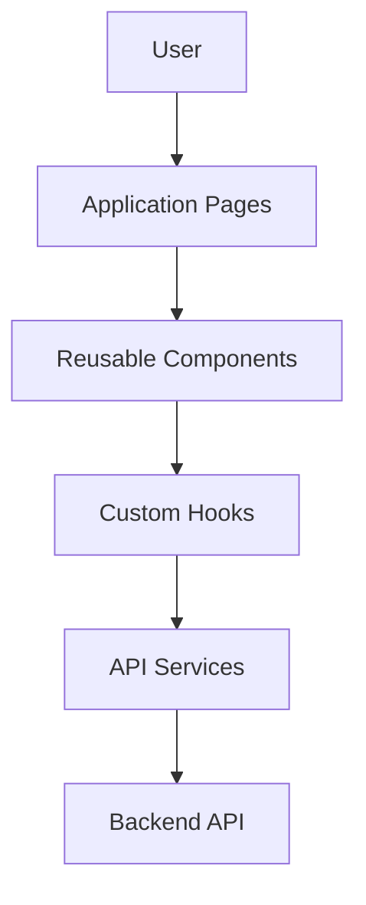
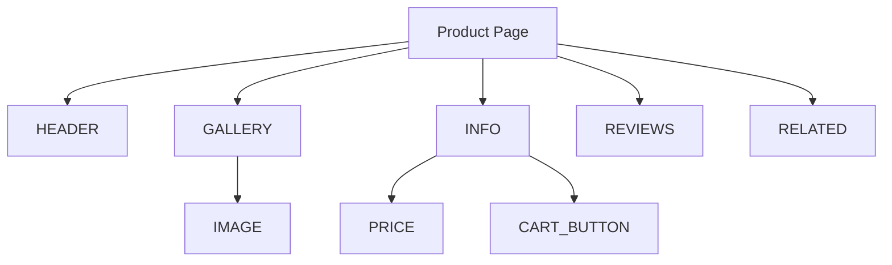
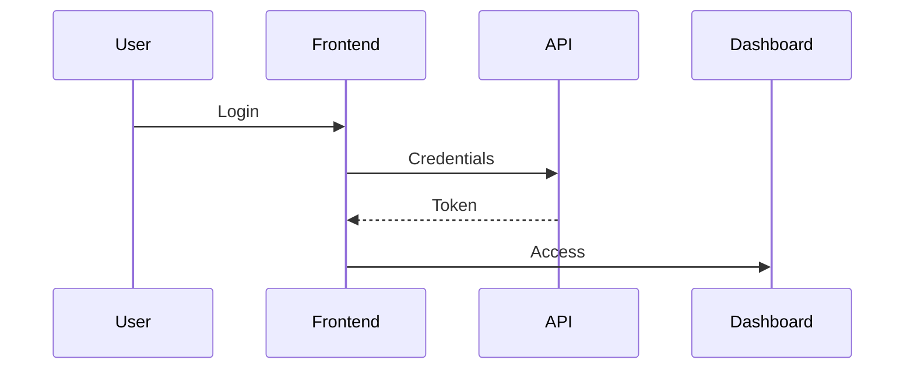

# FRONTEND ARCHITECTURE

> Project: Fardad Handicraft E-Commerce Platform

> Version: 1.0

> Status: Active

> Last Updated: 2026-07-19

> Owner: Software Architecture Team

---

# 1. Purpose

This document defines the frontend architecture of the Fardad platform.

The frontend must provide:

- Luxury user experience
- High performance
- SEO optimization
- Accessibility
- Responsive design
- Maintainable component structure

---

# 2. Frontend Technology

## Framework

Next.js

---

## Language

TypeScript

---

## Styling

Recommended:

- Component-based styling
- Design tokens
- Responsive utilities

---

## Rendering Strategy

The application uses a hybrid rendering approach:

- Server Side Rendering (SSR)
- Static Generation (SSG)
- Client Components when required

---

# 3. Frontend Architecture Principles

The frontend follows:

- Component-driven development
- Separation of concerns
- Reusable UI patterns
- Typed data contracts
- Performance-first design

---

# 4. High Level Frontend Architecture



---

# 5. Application Structure

Recommended structure:

```
frontend/

src/

├── app/

├── components/

├── features/

├── hooks/

├── services/

├── stores/

├── types/

├── utils/

├── styles/

├── constants/

└── tests/

```

---

# 6. Routing Architecture

Routes are organized by business domain.

Example:

```
/

 /products

 /products/[slug]

 /categories/[slug]

 /cart

 /checkout

 /account

 /dashboard

 /articles

```

---

# 7. Layout Architecture

Layouts:

```
Root Layout

↓

Public Layout

↓

Shop Layout

↓

Account Layout

↓

Admin Layout

```

---

# 8. Component Architecture

Components are divided into layers.

---

## UI Components

Generic components:

Examples:

- Button
- Input
- Modal
- Card
- Table
- Pagination

Location:

```
components/ui
```

---

## Business Components

Domain components:

Examples:

- ProductCard
- ShoppingCart
- OrderSummary
- InvoicePreview

Location:

```
features/*
```

---

## Page Components

Responsible for:

- Composition
- Data loading
- Layout

Must not contain reusable logic.

---

# 9. Component Hierarchy

Example:



---

# 10. Design System

The platform requires a unified design system.

Core elements:

## Colors

Luxury Persian handicraft identity:

- Emerald Green
- Matte Gold
- Warm Ivory
- Copper Metallic
- Marble Neutral

---

## Typography

Requirements:

- Persian RTL support
- Clear hierarchy
- Readability

---

## Components

Standardized:

- Buttons
- Forms
- Cards
- Navigation
- Tables
- Alerts

---

# 11. State Management Strategy

State is divided into:

---

## Server State

Examples:

- Products
- Orders
- Customer data

Managed through API data layer.

---

## Client State

Examples:

- Cart state
- UI state
- Modal state
- Preferences

---

## Form State

Examples:

- Checkout form
- Customer profile

---

# 12. Data Fetching Strategy

Rules:

Public pages:

Prefer server fetching.

Interactive pages:

Use client fetching.

---

Requirements:

- Loading states
- Error handling
- Cache strategy
- Revalidation

---

# 13. Form Architecture

Forms must include:

- Validation
- Error messages
- Loading state
- Success state

Examples:

- Registration
- Checkout
- Corporate registration
- Product management

---

# 14. Authentication Frontend

Authentication flow:



---

Frontend responsibilities:

- Token handling
- Protected routes
- Permission checks
- Session state

---

# 15. Product Experience Architecture

Product page must support:

- Multiple images
- Zoom
- Gallery
- Description
- Specifications
- Related products
- SEO information
- Add to cart

---

# 16. Checkout Architecture

Flow:

```
Cart

↓

Customer Information

↓

Address

↓

Shipping

↓

Payment

↓

Confirmation

```

---

# 17. Dashboard Frontend

Dashboard sections:

## Overview

- Sales
- Orders
- Users

## Product Management

- Products
- Images
- Inventory

## Content

- Articles
- Pages
- SEO

## Analytics

- Visitors
- Conversion

---

# 18. Responsive Strategy

Supported:

- Desktop
- Tablet
- Mobile

Rules:

- Mobile first
- Flexible layouts
- Optimized images
- Touch friendly controls

---

# 19. SEO Architecture

Every public page must support:

- Metadata
- Open Graph
- Structured Data
- Canonical URL
- Breadcrumbs

---

# 20. Performance Strategy

Requirements:

- Image optimization
- Code splitting
- Lazy loading
- Minimal client JavaScript
- Caching
- Fast navigation

---

# 21. Accessibility

Follow WCAG principles.

Required:

- Keyboard navigation
- Semantic HTML
- Alt text
- Form labels
- Focus states
- Screen reader support

---

# 22. Error Handling

Every feature requires:

Loading State

↓

Success State

↓

Empty State

↓

Error State

---

# 23. Frontend Security

Rules:

- Never expose secrets
- Validate user input
- Protect sensitive routes
- Handle tokens securely

---

# 24. Testing Strategy

Required:

## Unit Testing

Components

Hooks

Utilities


## Integration Testing

User flows


## End-to-End Testing

Critical journeys:

- Purchase
- Login
- Dashboard actions

---

# 25. Frontend Success Criteria

Frontend is successful when:

- User experience is premium.
- Pages load quickly.
- SEO requirements are satisfied.
- Components are reusable.
- Future development remains simple.

---

# Action Items

- Keep all components aligned with this architecture.
- Update this document when frontend architecture changes.
- Link major frontend decisions to ADR records.
- Validate every new feature against this architecture.