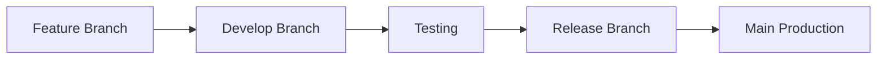
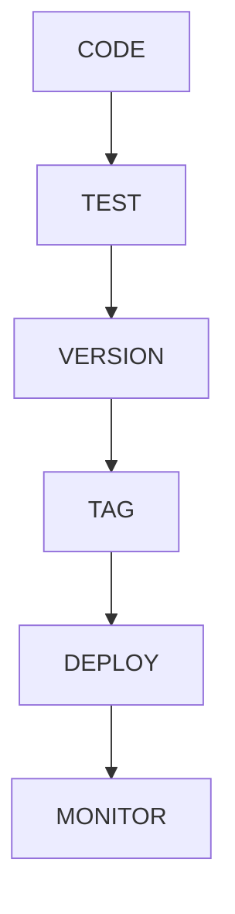

# GIT WORKFLOW

> Project: Fardad Handicraft E-Commerce Platform

> Version: 1.0

> Status: Active

> Last Updated: 2026-07-19

> Owner: Software Architecture Team

---

# 1. Purpose

This document defines the Git workflow strategy for the Fardad platform.

The objective is to provide:

- Safe development process
- Traceable changes
- Controlled releases
- Better collaboration between developers and AI coding agents
- Reliable rollback capability

---

# 2. Git Principles

The project follows:

- Every change must be traceable.
- Main branch must remain stable.
- Features must be isolated.
- Releases must be reproducible.
- Documentation must follow code changes.

---

# 3. Repository Strategy

The repository contains:

```
Application Code

Documentation

Configuration

Tests

Deployment Files

```

---

# 4. Branch Architecture

Recommended structure:

```
main

develop

feature/*

bugfix/*

hotfix/*

release/*

```

---

# 5. Main Branch

Purpose:

Production-ready code.

Rules:

- No direct commits.
- Only approved merges.
- Must always be deployable.

---

# 6. Develop Branch

Purpose:

Integration branch.

Contains:

- Completed features
- Tested changes
- Upcoming release work

---

# 7. Feature Branches

Format:

```
feature/module-name

```

Examples:

```
feature/product-catalog

feature/payment-gateway

feature/customer-dashboard

```

---

# 8. Bugfix Branches

Format:

```
bugfix/problem-name

```

Examples:

```
bugfix/order-calculation

bugfix/image-upload-error

```

---

# 9. Hotfix Branches

Purpose:

Emergency production fixes.

Format:

```
hotfix/issue-name

```

Examples:

```
hotfix/payment-failure

```

---

# 10. Release Branches

Purpose:

Prepare production releases.

Format:

```
release/version-number

```

Example:

```
release/v1.0.0

```

---

# 11. Development Flow



---

# 12. Commit Standards

Commit format:

```
type(scope): description

```

---

# 13. Commit Types

Allowed:

```
feat

fix

docs

style

refactor

test

chore

perf

security

```

---

Examples:

```
feat(product): add product gallery

fix(order): correct shipping calculation

docs(api): update API documentation

security(auth): improve token validation

```

---

# 14. Commit Rules

Commits must:

- Be small and focused.
- Describe one logical change.
- Avoid unrelated modifications.

---

Bad:

```
update files

```

Good:

```
feat(invoice): add corporate invoice generation

```

---

# 15. Pull Request Workflow

Every feature requires:

```
Branch

↓

Pull Request

↓

Code Review

↓

Tests

↓

Approval

↓

Merge

```

---

# 16. Pull Request Requirements

PR must include:

- Description
- Changed modules
- Testing result
- Screenshots if UI changes
- Documentation updates

---

# 17. AI / Codex Workflow

Codex changes must follow:

```
Task Definition

↓

Create Branch

↓

Generate Code

↓

Run Tests

↓

Review

↓

Merge

```

---

Rules:

Codex must not:

- Modify unrelated files.
- Change architecture without approval.
- Add dependencies without review.

---

# 18. Documentation Synchronization

Any major code change requires updating:

- Blueprint documents
- API documentation
- Database documentation
- Deployment documentation

---

# 19. Versioning Strategy

Use Semantic Versioning:

```
MAJOR.MINOR.PATCH

```

Example:

```
1.2.3

```

---

Meaning:

Major:

Breaking changes


Minor:

New features


Patch:

Bug fixes

---

# 20. Release Process

Release steps:



---

# 21. Git Tags

Every production release requires:

Example:

```
v1.0.0

```

Tags must identify:

- Release version
- Deployment point

---

# 22. Rollback Strategy

Rollback options:

## Application Rollback

Return previous version.


## Database Rollback

Use migration rollback.


## Media Rollback

Restore backup.

---

# 23. Protected Files

Special protection required for:

```
.env

production config

database credentials

security keys

```

---

# 24. Code Review Checklist

Before merge:

## Architecture

☐ Follows Blueprint

☐ Correct module placement


## Quality

☐ Clean code

☐ Tests included


## Security

☐ Permissions checked

☐ No secrets exposed


## Performance

☐ No unnecessary processing

---

# 25. Repository Maintenance

Regular tasks:

- Remove unused branches.
- Update dependencies.
- Review technical debt.
- Maintain documentation.

---

# 26. Backup Strategy

Repository backup:

- Remote Git hosting
- Protected main branch
- Release tags

---

# 27. Collaboration Rules

All contributors must:

- Follow branch rules.
- Write meaningful commits.
- Review changes.
- Update documentation.

---

# 28. Success Criteria

Git workflow is successful when:

- Every change is traceable.
- Production remains stable.
- Rollbacks are possible.
- Team collaboration is predictable.

---

# Action Items

- Create repository branch structure before implementation.
- Protect main branch.
- Enforce commit standards.
- Require review before merging.
- Maintain Git history quality.
- Link commits and releases to Work Orders.