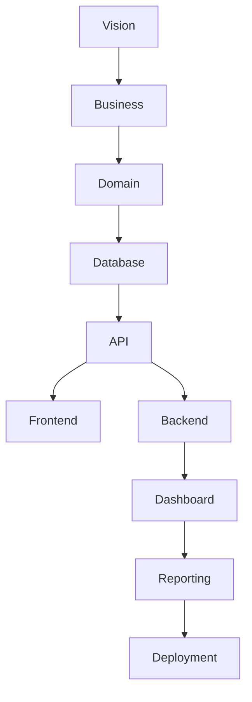

# MASTER BLUEPRINT INDEX

> Project: Fardad Handicraft E-Commerce Platform
>
> Version: 1.0
>
> Status: Active
>
> Last Updated: 2026-07-19
>
> Owner: Software Architecture Team

---

# Purpose

This document is the single source of truth for the Blueprint documentation.

It defines:

- Project documentation structure
- Chapter order
- Dependencies
- Reading sequence
- Implementation readiness

Every developer, architect and Codex task MUST reference this document before implementation.

---

# Blueprint Reading Order

The Blueprint must always be read in the following order.

| Order | Chapter | Status |
|--------|----------|--------|
|001|Vision & Project Foundation|Active|
|002|Business Domain & Product Definition|Active|
|003|Core Domain Model & System Entities|Active|
|004|...|Active|
|005|...|Active|
|006|...|Active|
|007|Information Architecture|Active|
|008|Sitemap & Navigation Architecture|Active|
|009|Database Architecture|Active|
|010|ER Diagram & Entity Relationships|Active|
|011|API Architecture|Active|
|012|Authentication & Authorization|Active|
|013|User Management|Active|
|014|CMS Engine|Active|
|015|Product Engine|Active|
|016|Product Variant Engine|Active|
|017|Inventory & Warehouse|Active|
|018|Pricing Engine|Active|
|019|Rule Engine|Active|
|020|Dashboard Architecture|Active|
|021|...|Active|
|022|...|Active|
|023|...|Active|
|024|...|Active|
|025|...|Active|
|026|...|Active|
|027|...|Active|
|028|...|Active|
|029|...|Active|
|030|...|Active|
|031|...|Active|
|032|...|Active|
|033|...|Active|
|034|...|Active|
|035|...|Active|
|036|...|Active|
|037|...|Active|
|038|...|Active|
|039|...|Active|
|040|...|Active|

---

# Documentation Layers

The project documentation is divided into five logical layers.

```
Business Layer

↓

Domain Layer

↓

Architecture Layer

↓

Implementation Layer

↓

Operations Layer
```

---

# Blueprint Categories

## Business

- Vision
- Business Rules
- Domain

---

## Architecture

- Database
- API
- Frontend
- Backend
- Security

---

## Commerce

- Product
- Inventory
- Pricing
- Orders
- Dashboard

---

## Operations

- Deployment
- Monitoring
- Backup

---

# Blueprint Dependency Flow



---

# Documentation Rules

Every Blueprint chapter must contain:

- Purpose
- Scope
- Functional Requirements
- Non-functional Requirements
- Business Rules
- Dependencies
- Risks
- Open Questions
- Future Enhancements
- Action Items

---

# Blueprint Naming Convention

Every chapter must follow:

```
Chapter XXX - Title.md
```

Example

```
Chapter 015 - Product Engine.md
```

---

# Status Definitions

| Status | Meaning |
|----------|----------|
|Draft|Work in progress|
|Review|Needs validation|
|Approved|Ready for implementation|
|Deprecated|Do not use|

---

# Change Management

Every architectural change must:

1. Update the related Blueprint chapter.

2. Update Dependency Matrix.

3. Update Work Order if required.

4. Update this Master Index if chapter structure changes.

Implementation MUST NOT start until Blueprint remains consistent.

---

# Rules for Codex

Codex MUST:

- Read this document first.
- Never skip chapter dependencies.
- Never implement features outside Blueprint.
- Never guess missing requirements.
- Stop implementation if Blueprint contains conflicts.
- Reference chapter numbers in every implementation report.

---

# Project Philosophy

Blueprint First.

Architecture Before Code.

Business Before Technology.

Documentation Before Implementation.

Quality Before Speed.

---

# Action Items

- Maintain this document as the root index of all Blueprint chapters.
- Update whenever a chapter is added, removed or renamed.
- Review after every major architectural milestone.