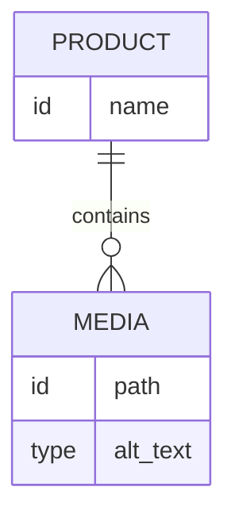

# MEDIA & IMAGE PIPELINE ARCHITECTURE

> Project: Fardad Handicraft E-Commerce Platform

> Version: 1.0

> Status: Active

> Last Updated: 2026-07-19

> Owner: Software Architecture Team

---

# 1. Purpose

This document defines the media and image management architecture of the Fardad platform.

The purpose is to provide a professional image pipeline suitable for luxury handicraft products.

The system must support:

- High-quality product photography
- Fast website delivery
- SEO optimized images
- Digital catalogs
- Product galleries
- Content images
- Future CDN integration

---

# 2. Media Architecture Principles

The media system follows:

- Original file preservation
- Automated optimization
- Multiple image resolutions
- Metadata management
- Secure upload
- Performance optimization

---

# 3. Media Types

The platform supports:

## Product Images

Examples:

- Main product image
- Gallery images
- Detail images
- Packaging images


---

## Content Images

Used for:

- Articles
- Blog
- Landing pages


---

## Marketing Assets

Examples:

- Banners
- Catalog covers
- Social media assets

---

## User Uploaded Files

Examples:

- Corporate documents
- Profile images

---

# 4. Media Pipeline Overview


---

# 5. Upload Architecture

Upload process:

```
User/Admin

↓

Upload API

↓

Validation Layer

↓

Processing Queue

↓

Storage

↓

Database Metadata

```

---

# 6. Supported Formats

## Input Formats

Supported:

- JPG
- PNG
- WEBP
- SVG (limited use)

---

## Output Formats

Primary:

- WebP

Future:

- AVIF

---

# 7. Image Processing Pipeline

After upload:

## Step 1: Validation

Checks:

- File type
- File size
- Dimensions
- Security


---

## Step 2: Optimization

Actions:

- Compression
- Metadata cleanup
- Color profile normalization


---

## Step 3: Generate Variants

For every image:

```
Original

↓

Large

↓

Medium

↓

Small

↓

Thumbnail

```

---

# 8. Image Size Strategy

Recommended sizes:

## Product Main

```
1600px+
```

Purpose:

Luxury product viewing

---

## Product Listing

```
600px
```

Purpose:

Category pages

---

## Thumbnail

```
200px
```

Purpose:

Admin tables

---

# 9. Storage Architecture

Recommended:

Object Storage

Examples:

- S3 compatible storage
- Cloud storage
- Dedicated media server


Structure:

```
media/

products/

    product-id/

        original/

        large/

        medium/

        thumbnail/


articles/

marketing/

```

---

# 10. Database Media Model

Media entity:

```
Media

id

filename

original_name

path

mime_type

size

width

height

format

alt_text

created_at

```

---

# 11. Product Image Relationship



---

# 12. Image Metadata

Every public image should support:

Required:

- Alt Text
- Title
- Description
- Copyright information (optional)

---

# 13. SEO Image Strategy

Rules:

Every important image requires:

- Meaningful filename
- Persian/English SEO keywords where appropriate
- Alt text
- Correct dimensions


Example:

Bad:

```
IMG_93842.jpg
```

Good:

```
turquoise-handmade-box-fardad.jpg
```

---

# 14. Image Security

Upload protection:

Required:

- MIME validation
- Extension validation
- File size limits
- Malware scanning (future)
- Access control


Never allow:

- Executable uploads
- Unknown file types

---

# 15. Admin Media Library

Admin features:

- Upload
- Search
- Filter
- Replace
- Delete
- Assign to products
- Manage metadata

---

# 16. Product Gallery Architecture

Gallery supports:

- Multiple images
- Ordering
- Main image selection
- Zoom
- Fullscreen view
- Detail shots


Structure:

```
Product

|

Gallery

|

Images

```

---

# 17. Image Loading Strategy

Frontend:

Use:

- Lazy loading
- Responsive images
- Proper sizing
- Browser caching


Priority:

Main product image:

High priority


Secondary images:

Lazy loaded

---

# 18. CDN Strategy

Current:

Application storage


Future:

CDN integration


Benefits:

- Faster global delivery
- Reduced server load
- Better international access

---

# 19. Image Backup Strategy

Required:

- Regular backup
- Storage redundancy
- Restore testing


Important assets:

- Product photography
- Catalog images
- Marketing materials

---

# 20. Digital Catalog Support

Media system must support:

- High-resolution export
- Product collections
- PDF generation
- Corporate catalog creation

---

# 21. Performance Requirements

Goals:

- Fast image delivery
- Minimal page weight
- Optimized mobile experience

---

# 22. Testing Requirements

Test:

## Upload

- Valid files
- Invalid files
- Large files


## Processing

- Conversion
- Compression
- Thumbnail generation


## Delivery

- Browser compatibility
- Mobile performance

---

# 23. Future Extensions

Possible features:

- AI image enhancement
- Automatic background removal
- Product image tagging
- Visual search
- AI-generated descriptions

---

# 24. Success Criteria

Media architecture is successful when:

- Product images maintain luxury quality.
- Pages load quickly.
- SEO images are optimized.
- Storage remains manageable.
- Future CDN integration is simple.

---

# Action Items

- Implement media architecture before product catalog completion.
- Never store unprocessed public images.
- Maintain image metadata standards.
- Link media changes to Work Orders.
- Review storage strategy before production deployment.