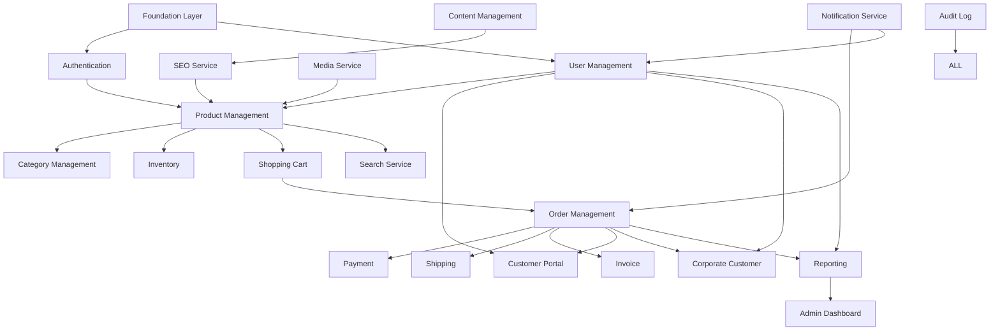

# MODULE DEPENDENCY MAP

> Project: Fardad Handicraft E-Commerce Platform

> Version: 1.0

> Status: Active

> Last Updated: 2026-07-19

> Owner: Software Architecture Team

---

# 1. Purpose

This document defines the dependency relationship between all platform modules.

The objective:

- Prevent circular dependencies.
- Define implementation order.
- Protect architectural boundaries.
- Guide Codex implementation.

---

# 2. Module Architecture Overview

The platform is divided into:

```
Foundation Modules

↓

Core Business Modules

↓

Supporting Services

↓

User Experience Modules

↓

Analytics & Optimization Modules

```

---

# 3. Complete Module Map



---

# 4. Foundation Modules

## 4.1 Authentication

Priority:

P0

Depends on:

```
Foundation

Database

Security Layer

```

Used by:

- Customers
- Admins
- Corporate users

---

## 4.2 User Management

Priority:

P0

Depends on:

```
Authentication

Database

```

Provides:

- Profiles
- Roles
- Permissions

---

# 5. Cross-Cutting Services

These services must be implemented before business modules.

---

# 5.1 Media Service

Priority:

P0

Used by:

- Products
- Articles
- Catalogs
- User documents

Dependencies:

```
Storage

Security

```

---

# 5.2 Notification Service

Priority:

P1

Used by:

- Login OTP
- Orders
- Payment status
- Marketing

Channels:

```
SMS

Email

Internal Notification

```

---

# 5.3 Audit Log Service

Priority:

P1

Used by:

- Admin actions
- Security events
- Business changes

Tracks:

- User
- Action
- Time
- Result

---

# 5.4 Search Service

Priority:

P1

Depends on:

```
Product

Category

Content

```

Provides:

- Product search
- Filtering
- Suggestions

---

# 5.5 SEO Service

Priority:

P1

Depends on:

```
Product

Content

Pages

```

Provides:

- Metadata
- Sitemap
- Structured data

---

# 6. Product Domain

## Product Management

Priority:

P0

Depends on:

```
Authentication

Media

Category

Inventory

```

Provides:

- Product information
- Pricing
- Images
- Attributes

---

# 7. Commerce Domain

## Shopping Cart

Priority:

P0

Depends on:

```
Product

User

```

---

## Order Management

Priority:

P0

Depends on:

```
Cart

Customer

Payment

Shipping

```

---

## Payment

Priority:

P0

Depends on:

```
Order

Notification

Audit

```

---

## Shipping

Priority:

P1

Depends on:

```
Order

Customer Address

External Providers

```

---

## Invoice

Priority:

P1

Depends on:

```
Order

Customer Data

Corporate Data

```

---

# 8. Customer Modules

## Customer Portal

Priority:

P1

Depends on:

```
Authentication

Orders

Invoice

```

Features:

- Profile
- Orders
- Documents
- Favorites

---

## Corporate Customer

Priority:

P1

Depends on:

```
User Management

Invoice

Order

Verification

```

Features:

- Company profile
- Legal information
- Official invoices

---

# 9. Administration Modules

## Admin Dashboard

Priority:

P1

Depends on:

```
All Business Modules

Reporting

Audit

```

Provides:

- Management interface
- Statistics
- Operations control

---

# 10. Reporting Architecture

Priority:

P1

Depends on:

```
Users

Orders

Products

Content

Audit

```

Provides:

- Sales reports
- User reports
- Product analytics

---

# 11. Content Management

Priority:

P2

Depends on:

```
Media

SEO

User Permissions

```

Provides:

- Articles
- Pages
- Landing pages

---

# 12. Implementation Dependency Order

Recommended sequence:

```
1. Database Foundation

2. Authentication

3. User Management

4. Media Service

5. Audit Log

6. Notification Service

7. Product System

8. Search Service

9. Cart

10. Order System

11. Payment

12. Shipping

13. Invoice

14. Customer Portal

15. Corporate Customer

16. Admin Dashboard

17. Content System

18. Reporting

19. SEO Optimization

```

---

# 13. Forbidden Dependencies

The following are prohibited:

```
Frontend --> Database

Product --> Payment

Notification --> Order Database Direct Access

Dashboard --> Business Logic

```

---

# 14. Circular Dependency Prevention

Rules:

- Modules communicate through services.
- Shared logic belongs to common services.
- Business modules cannot directly access each other's database.

---

# 15. Future Expansion

Possible future modules:

- AI Recommendation Engine
- CRM Integration
- Marketplace Module
- Multi Vendor Support
- Advanced BI System

---

# 16. Success Criteria

The dependency map is successful when:

- Every module has clear ownership.
- Implementation order is predictable.
- Codex can work module by module.
- Architecture remains scalable.

---

# Action Items

- Review dependencies before creating new modules.
- Update this document when architecture changes.
- Do not introduce hidden dependencies.
- Link every Work Order to required modules.
- Validate module boundaries during code review.