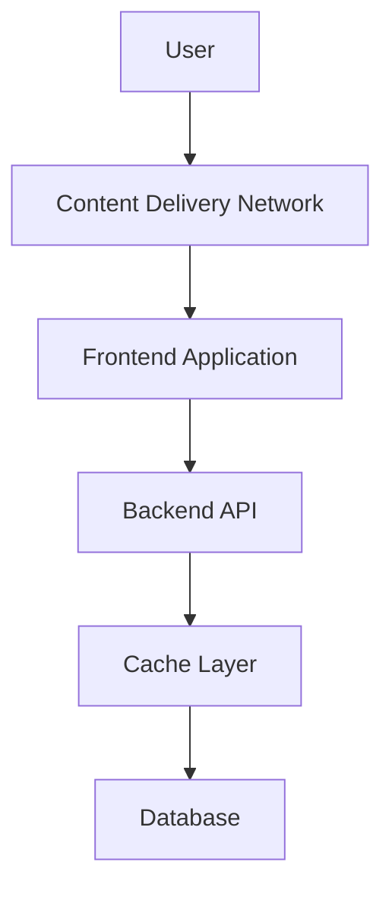
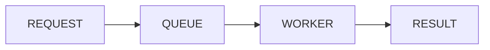

# PERFORMANCE STRATEGY

> Project: Fardad Handicraft E-Commerce Platform

> Version: 1.0

> Status: Active

> Last Updated: 2026-07-19

> Owner: Software Architecture Team

---

# 1. Purpose

This document defines the performance strategy of the Fardad platform.

The objective is to guarantee:

- Fast page loading
- Smooth user experience
- Scalability
- Efficient resource usage
- Stable operation under increasing traffic

---

# 2. Performance Goals

The platform should achieve:

## User Experience

- Fast first page load
- Smooth navigation
- Responsive interactions


## Business Requirements

- Fast product browsing
- Fast checkout process
- Fast dashboard reporting


## Technical Requirements

- Optimized database queries
- Efficient API responses
- Optimized media delivery

---

# 3. Performance Architecture Overview



---

# 4. Performance Principles

The system follows:

- Measure before optimizing
- Avoid unnecessary processing
- Cache frequently used data
- Optimize heavy operations
- Move expensive tasks to background jobs

---

# 5. Frontend Performance Strategy

## Rendering Strategy

Use:

- Server Side Rendering
- Static Generation
- Client Rendering only when required


---

# 6. Code Optimization

Required:

- Code splitting
- Lazy loading
- Dynamic imports
- Remove unused dependencies


---

# 7. Image Performance Strategy

Images are the largest performance factor.

Required:

- Responsive images
- WebP / AVIF formats
- Lazy loading
- Proper dimensions
- Compression


Pipeline:

```
Original Image

↓

Optimization

↓

Multiple Sizes

↓

Delivery

```

---

# 8. Product Page Performance

Product pages must optimize:

- Main image loading
- Gallery loading
- Related products
- Reviews


Strategy:

Load:

Primary image first

↓

Secondary images later

↓

Additional content asynchronously

---

# 9. Backend Performance Strategy

Backend optimization areas:

- API response time
- Database queries
- Business logic processing
- External integrations


---

# 10. API Performance

Rules:

- Pagination required
- Avoid unnecessary fields
- Validate query limits
- Use caching where possible


Example:

Bad:

```
GET /products

returns 10000 products

```

Good:

```
GET /products?page=1&limit=20

```

---

# 11. Database Performance

Required:

## Indexing

Important indexes:

- Product slug
- Product category
- Order status
- User email
- Created dates


---

## Query Optimization

Avoid:

- N+1 queries
- Large unnecessary joins
- Repeated calculations


---

# 12. Cache Strategy

Caching areas:

## Public Data

Examples:

- Categories
- Product lists
- SEO metadata


## Dashboard Data

Examples:

- Reports
- Statistics


---

# 13. Cache Invalidation

Cache must refresh after:

- Product update
- Price change
- Inventory update
- Content update

---

# 14. Background Processing

Heavy operations must run asynchronously.

Examples:

- Image processing
- PDF generation
- Report generation
- Bulk notifications


Architecture:



---

# 15. Search Performance

Future search system should support:

- Fast product search
- Filtering
- Suggestions
- Typo tolerance


Possible technology:

Search engine layer

---

# 16. Dashboard Performance

Dashboard must not calculate heavy reports on every request.

Strategy:

```
Raw Data

↓

Aggregation Jobs

↓

Prepared Statistics

↓

Dashboard

```

---

# 17. Monitoring Strategy

Monitor:

## Frontend

- Page load time
- JavaScript errors
- Core Web Vitals


## Backend

- API latency
- Error rate
- Resource usage


## Database

- Slow queries
- Connection usage

---

# 18. Core Web Vitals

Important metrics:

## LCP

Largest Contentful Paint


## CLS

Cumulative Layout Shift


## INP

Interaction to Next Paint


---

# 19. Mobile Performance

Requirements:

- Lightweight pages
- Optimized images
- Reduced JavaScript
- Fast checkout


---

# 20. Security vs Performance Balance

Optimization must not reduce security.

Examples:

Must keep:

- Authentication checks
- Permission validation
- Input validation


---

# 21. Scalability Strategy

Current:

Modular Monolith


Future:

Possible separation of:

- Media Service
- Search Service
- Notification Service
- Analytics Service

---

# 22. Load Testing

Required scenarios:

## Product browsing

Large number of visitors


## Checkout

Concurrent orders


## Dashboard

Large reports


---

# 23. Performance Testing Tools

Recommended:

- Lighthouse
- Web performance monitoring
- API load testing tools


---

# 24. Performance Success Criteria

The system is successful when:

- Customers experience fast browsing.
- Images load efficiently.
- Checkout remains stable.
- Dashboard remains responsive.
- Growth does not require immediate redesign.

---

# Action Items

- Define performance budgets before production.
- Monitor performance continuously.
- Optimize based on measured bottlenecks.
- Review database indexes periodically.
- Link performance improvements to Work Orders.