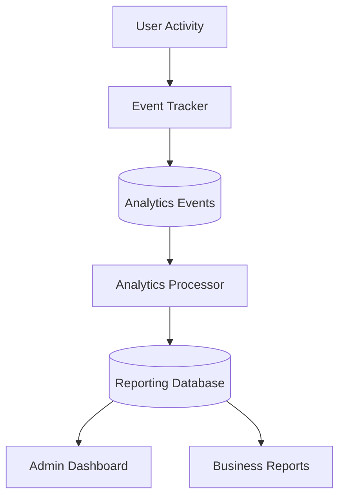
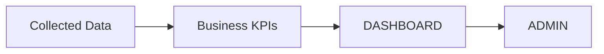
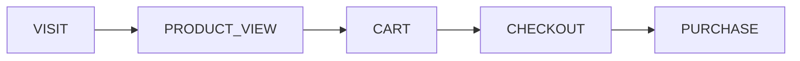

# REPORTING ANALYTICS ARCHITECTURE

> Project: Fardad Handicraft E-Commerce Platform

> Version: 1.0

> Status: Active

> Last Updated: 2026-07-19

> Owner: Software Architecture Team

---

# 1. Purpose

This document defines the reporting and analytics architecture of the Fardad platform.

The objective is to create a complete management intelligence system that provides visibility into:

- Business performance
- Customer behavior
- Product performance
- Content performance
- Operational activities

---

# 2. Analytics Principles

The analytics system follows:

- Data accuracy
- Event-based tracking
- Historical data preservation
- Real-time visibility where required
- Privacy protection

---

# 3. Analytics Architecture Overview



---

# 4. Analytics Data Sources

The system collects data from:

## Customer Activity

- Page views
- Product views
- Searches
- Cart actions
- Checkout actions


## Sales Activity

- Orders
- Payments
- Returns
- Cancellations


## Content Activity

- Article views
- Landing page visits
- SEO traffic


## Internal Activity

- Product creation
- Image uploads
- Content updates
- Admin actions

---

# 5. Event Tracking System

Every important action creates an event.

Example:

```json
{
 "event":"product_view",
 "user_id":123,
 "product_id":456,
 "timestamp":"2026-07-19"
}
```

---

# 6. Event Types

## User Events

```
user_registered

user_login

user_logout

profile_updated

```

---

## Product Events

```
product_created

product_updated

product_viewed

product_added_to_cart

```

---

## Order Events

```
cart_created

checkout_started

order_created

payment_success

payment_failed

order_cancelled

```

---

## Content Events

```
page_view

article_view

search_performed

```

---

# 7. Business Dashboard Architecture



---

# 8. Executive Dashboard

Main indicators:

## Sales

- Total revenue
- Number of orders
- Average order value
- Conversion rate


## Customers

- New customers
- Returning customers
- Corporate customers


## Products

- Best selling products
- Most viewed products
- Low inventory products

---

# 9. Product Analytics

Track:

- Product views
- Add to cart count
- Purchase count
- Conversion rate


Example:

```
Product A

Views:
5000

Cart:
300

Sales:
80

Conversion:
16%

```

---

# 10. Content Analytics

Track:

- Article visits
- Page visits
- Search traffic
- SEO performance


Used for:

- Marketing decisions
- Content planning

---

# 11. Order Analytics

Dashboard metrics:

## Order Status

```
Pending

Paid

Processing

Shipped

Completed

Cancelled

```

---

Reports:

- Daily orders
- Monthly orders
- Failed payments
- Abandoned carts

---

# 12. Customer Behavior Analytics

Track:

- Customer journey
- Visited products
- Purchase history
- Preferences

---

Customer funnel:



---

# 13. Internal Operation Analytics

Management activities:

Track:

## Product Team

- Products created per day
- Images uploaded per day
- Product updates


## Content Team

- Articles published
- Pages updated


## Sales Team

- Orders processed
- Customer responses

---

# 14. Reporting Database

Recommended architecture:

```
Operational Database

+

Analytics Database

```

---

Reason:

Prevent reporting queries from affecting customer transactions.

---

# 15. KPI Management

KPIs should be configurable.

Examples:

```
Daily Sales

Monthly Revenue

Customer Growth

Product Performance

```

---

# 16. Dashboard Components

Required components:

## Cards

Examples:

- Revenue
- Orders
- Visitors


## Charts

Examples:

- Sales trend
- Traffic trend


## Tables

Examples:

- Recent orders
- Best products

---

# 17. Data Retention

Important events should be preserved.

Recommended:

```
Raw Events:
Long term

Aggregated Reports:
Fast access

```

---

# 18. Privacy Requirements

Analytics must protect:

- Customer identity
- Personal information
- Payment information

---

Never store:

- Card information
- Passwords

---

# 19. Performance Strategy

Analytics processing should use:

- Background jobs
- Aggregation
- Caching

---

Avoid:

Heavy analytics queries on production transactions.

---

# 20. Future Expansion

Possible additions:

- AI sales prediction
- Recommendation engine
- Customer segmentation
- Marketing automation
- BI integration

---

# 21. Implementation Priority

Priority order:

```
1. Event Tracking Foundation

2. Basic Dashboard KPIs

3. Order Analytics

4. Product Analytics

5. Customer Analytics

6. Content Analytics

7. Advanced BI

```

---

# 22. Success Criteria

Analytics architecture is successful when:

- Managers understand business status quickly.
- Decisions are based on reliable data.
- Historical trends are available.
- System performance remains stable.

---

# Action Items

- Define analytics events before implementation.
- Keep event naming consistent.
- Protect customer privacy.
- Validate dashboard calculations.
- Connect analytics tasks to Codex Work Orders.