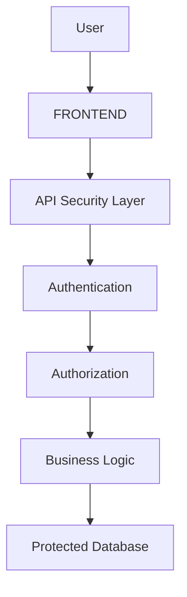
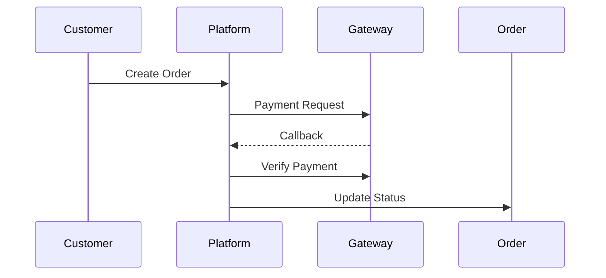

# SECURITY CHECKLIST

> Project: Fardad Handicraft E-Commerce Platform

> Version: 1.0

> Status: Active

> Last Updated: 2026-07-19

> Owner: Software Architecture Team

---

# 1. Purpose

This document defines the security requirements and checklist for the Fardad platform.

The objective is to protect:

- User information
- Customer accounts
- Corporate data
- Payment processes
- Product assets
- Administrative operations
- System infrastructure

---

# 2. Security Principles

The platform follows:

- Security by design
- Least privilege principle
- Defense in depth
- Secure defaults
- Continuous monitoring

---

# 3. Security Architecture Overview



---

# 4. Authentication Security

Required:

- Secure password hashing
- Token expiration
- Refresh token management
- Session invalidation
- Login monitoring

---

## Password Rules

Must support:

- Minimum password length
- Password complexity
- Secure reset process

Never store:

```
Plain Text Password
```

---

# 5. Authorization Security

All protected operations require:

- Authentication check
- Role validation
- Permission validation

---

Example:

Wrong:

```
Frontend hides admin button

```

Correct:

```
Backend blocks unauthorized request

```

---

# 6. Role Security

Roles:

- Customer
- Corporate Customer
- Sales Manager
- Content Manager
- SEO Manager
- Administrator

---

Rules:

- Users cannot increase their own permissions.
- Permission changes require audit logging.
- Sensitive roles require stronger controls.

---

# 7. API Security

Required:

- Input validation
- Rate limiting
- Request logging
- Secure headers
- Error handling

---

Never expose:

- Database errors
- Internal paths
- Sensitive configuration

---

# 8. Input Validation

All inputs require validation:

Examples:

- User registration
- Product creation
- Checkout forms
- Corporate information
- SEO fields

---

Protection against:

- SQL Injection
- XSS
- Malicious payloads

---

# 9. Database Security

Requirements:

- Restricted database access
- Strong credentials
- Encrypted connections
- Regular backups

---

Database rules:

- No direct frontend access.
- No database credentials in source code.
- Use migrations.

---

# 10. Payment Security

Payment module must:

- Never store card information.
- Validate payment callbacks.
- Verify transaction status.
- Log payment events.

---

Payment flow:



---

# 11. File Upload Security

Media uploads require:

- File type validation
- File size limitation
- Extension validation
- Safe storage

---

Forbidden uploads:

- Executable files
- Unknown formats
- Server-side scripts

---

# 12. Image Security

Images must:

- Be processed before public access.
- Remove unnecessary metadata.
- Have controlled storage paths.

---

# 13. Admin Panel Security

Admin panel requires:

- Strong authentication
- Role-based access
- Audit logs
- Session management

---

Sensitive actions:

- Delete product
- Change price
- Change permissions
- Export customer data

must be logged.

---

# 14. Audit Log Security

Audit records include:

```
User ID

Action

Timestamp

IP Address

Device

Result

```

---

Tracked events:

- Login
- Failed login
- Permission changes
- Product changes
- Order changes

---

# 15. Personal Data Protection

Protected information:

- Customer name
- Phone number
- Address
- Corporate information
- Invoice data

---

Rules:

- Collect only required data.
- Limit access.
- Protect exports.

---

# 16. Corporate Customer Security

Corporate information requires:

- Verification status
- Access control
- Secure document handling

---

# 17. SEO Security

Protect against:

- Metadata injection
- Malicious scripts
- Invalid structured data

---

# 18. Frontend Security

Requirements:

- Secure API communication
- No exposed secrets
- Safe rendering
- Input sanitization

---

Never store:

- Passwords
- Payment data
- Private keys

---

# 19. Backend Security

Required:

- Secure configuration
- Environment variables
- Dependency monitoring
- Error isolation

---

# 20. Infrastructure Security

Required:

- HTTPS
- Firewall rules
- Server updates
- Access monitoring

---

# 21. Backup Security

Backup strategy:

- Regular backups
- Encrypted storage
- Restore testing

Backup targets:

- Database
- Product images
- Documents
- Configuration

---

# 22. Dependency Security

Before production:

Check:

- Vulnerable packages
- Outdated dependencies
- License issues

---

# 23. Logging Security

Logs must not contain:

- Passwords
- Tokens
- Payment information

---

Logs must contain:

- Errors
- Security events
- Important operations

---

# 24. Monitoring Security

Monitor:

- Failed logins
- Suspicious requests
- Server errors
- Performance anomalies

---

# 25. Testing Security

Required tests:

## Authentication Tests

- Login
- Logout
- Token expiration


## Authorization Tests

- Permission denial
- Role changes


## Input Tests

- Invalid data
- Malicious input


## File Tests

- Invalid uploads

---

# 26. Production Security Checklist

Before launch:

## Application

☐ Authentication completed

☐ Authorization tested

☐ Audit logs enabled

☐ Error handling configured


## Database

☐ Backup enabled

☐ Credentials secured

☐ Access restricted


## Infrastructure

☐ HTTPS enabled

☐ Monitoring enabled

☐ Server hardened


## Business

☐ Payment flow tested

☐ Invoice generation tested

☐ Customer privacy verified

---

# 27. Future Security Improvements

Possible additions:

- Two-factor authentication
- Fraud detection
- Advanced monitoring
- Security information management system

---

# 28. Security Success Criteria

Security is successful when:

- Unauthorized access is prevented.
- Sensitive information is protected.
- Business operations are traceable.
- Production environment remains secure.

---

# Action Items

- Perform security review before every major release.
- Keep dependencies updated.
- Audit sensitive operations.
- Test backup recovery regularly.
- Link security improvements to Work Orders.