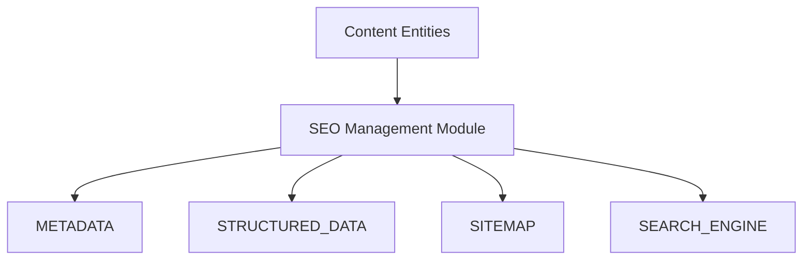

# SEO ARCHITECTURE

> Project: Fardad Handicraft E-Commerce Platform

> Version: 1.0

> Status: Active

> Last Updated: 2026-07-19

> Owner: Software Architecture Team

---

# 1. Purpose

This document defines the SEO architecture of the Fardad platform.

The SEO system must support:

- Product discovery
- Organic traffic growth
- Search engine visibility
- Corporate customer acquisition
- Content marketing
- International expansion

---

# 2. SEO Architecture Principles

SEO must be:

- Built into the platform core.
- Managed through structured data.
- Independent from frontend implementation.
- Scalable for thousands of products and pages.

---

# 3. SEO Architecture Overview



---

# 4. SEO Managed Entities

SEO support is required for:

## Products

Examples:

- Handmade gift boxes
- Turquoise products
- Enamel products
- Copper artworks


---

## Categories

Examples:

- Luxury Gift Packages
- Persian Handicrafts
- Corporate Gifts


---

## Articles

Examples:

- History of Persian handicrafts
- Buying guides
- Craftsmanship stories


---

## Pages

Examples:

- About Us
- Corporate Services
- Contact

---

# 5. SEO Data Model

Every SEO-enabled entity contains:

```
SEO

id

entity_type

entity_id

title

description

keywords

canonical_url

robots

schema_data

created_at

updated_at

```

---

# 6. Metadata Architecture

Each page supports:

## Title

Example:

```
Luxury Persian Handmade Gift Box | Fardad
```

---

## Meta Description

Example:

```
Premium Persian handicraft gift packages suitable for corporate gifts.
```

---

## Keywords

Managed internally for analysis.

---

# 7. URL Architecture

SEO-friendly URLs:

Recommended:

```
/products/turquoise-gift-box
```

Avoid:

```
/product?id=123
```

---

# 8. Product SEO Architecture

Each product page must contain:

Required:

- SEO title
- Description
- Product schema
- Images with alt text
- Specifications
- Related products
- Reviews


---

# 9. Category SEO Architecture

Category pages require:

- Unique introduction
- SEO metadata
- Product listing
- Internal links


Example:

```
/categories/corporate-gifts
```

---

# 10. Article SEO Architecture

Articles support:

- Author
- Published date
- Updated date
- Category
- Related products
- Structured data


---

# 11. Structured Data Strategy

Supported schemas:

## Product Schema

Includes:

- Name
- Image
- Price
- Availability
- Brand


---

## Organization Schema

Includes:

- Company information
- Logo
- Contact


---

## Article Schema

Includes:

- Author
- Date
- Content


---

## Breadcrumb Schema

For:

- Products
- Categories
- Articles

---

# 12. Sitemap Architecture

Generated automatically.

Required sitemaps:

```
sitemap.xml

products-sitemap.xml

categories-sitemap.xml

articles-sitemap.xml

images-sitemap.xml

```

---

# 13. Robots Management

System supports:

- robots.txt
- Page indexing control
- Noindex rules


Examples:

No index:

```
/admin

/cart

/checkout

```

---

# 14. Canonical URL Strategy

Purpose:

Prevent duplicate content.

Required for:

- Products
- Filters
- Pagination
- Categories

---

# 15. Internal Linking Strategy

The system should support:

Product →

Category

↓

Article

↓

Related Products


---

# 16. Image SEO

Every important image requires:

- Optimized filename
- Alt text
- Proper dimensions
- Structured relation with entity


---

# 17. SEO Dashboard

Admin dashboard should show:

## Technical SEO

- Missing metadata
- Broken links
- Index status


## Content SEO

- Article performance
- Keyword targets


## Product SEO

- Missing descriptions
- Missing images
- SEO score

---

# 18. SEO Workflow

Content creation:

```
Create Entity

↓

Add SEO Information

↓

Generate Structured Data

↓

Publish

↓

Monitor Performance

```

---

# 19. Search Engine Integration

Supported:

- Google Search Console
- Analytics tools
- Webmaster tools


---

# 20. Performance SEO

SEO depends on:

- Fast loading
- Optimized images
- Mobile performance
- Clean HTML
- Stable layout


---

# 21. International SEO

Future support:

- Persian
- English
- Arabic


Requirements:

- hreflang
- Language URLs
- Translated metadata


---

# 22. SEO Security

Protect:

- Metadata injection
- Malicious HTML
- Invalid schema


---

# 23. Testing Requirements

SEO tests:

- Metadata validation
- Structured data validation
- Sitemap validation
- Mobile compatibility
- Broken link checks


---

# 24. SEO Success Criteria

SEO architecture is successful when:

- Pages are indexable.
- Products appear correctly in search.
- Content can grow without technical limitations.
- Marketing team can manage SEO independently.

---

# Action Items

- Implement SEO module before content expansion.
- Require SEO data for every public entity.
- Monitor technical SEO continuously.
- Maintain structured data standards.
- Link SEO changes to Work Orders.