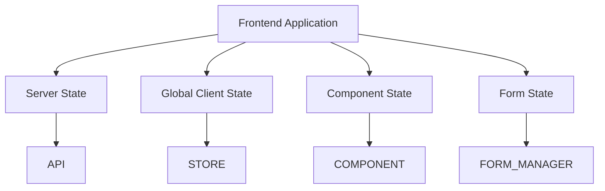
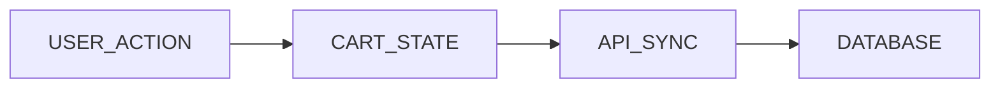
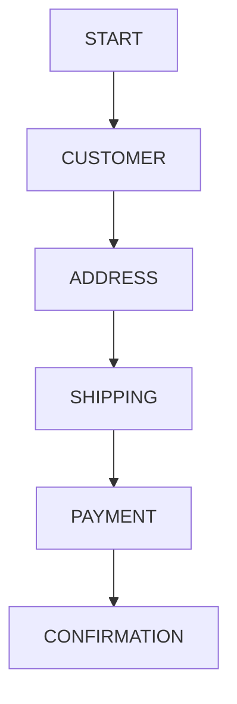
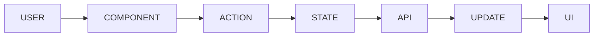

# STATE MANAGEMENT STRATEGY

> Project: Fardad Handicraft E-Commerce Platform

> Version: 1.0

> Status: Active

> Last Updated: 2026-07-19

> Owner: Software Architecture Team

---

# 1. Purpose

This document defines the state management strategy for the Fardad frontend application.

The goal is to maintain:

- Predictable application behavior
- Clean data flow
- Scalable frontend architecture
- Separation between server and client state

---

# 2. State Management Principles

The application follows these principles:

- Server state and client state must be separated.
- Global state should be minimized.
- Components should own local state whenever possible.
- Business data should not be duplicated.
- State changes must be predictable and traceable.

---

# 3. State Categories

The system contains four main state categories:

```
Server State

Client Global State

Local Component State

Form State
```

---

# 4. State Architecture Overview



---

# 5. Server State Management

## Definition

Server state includes data owned by Backend.

Examples:

- Products
- Categories
- Orders
- Customers
- Inventory
- Dashboard reports

---

## Management Strategy

Recommended:

API Query Layer

Responsibilities:

- Fetching
- Caching
- Refetching
- Synchronization
- Error handling

---

## Rules

Server data must not be duplicated inside global client state.

Wrong:

```
API Product Data

+

Separate Product Store

```

Correct:

```
API Cache

↓

Components
```

---

# 6. Client Global State

Global state contains application-wide UI information.

Examples:

- Authentication status
- Theme
- Language
- Cart summary
- Notification center

---

# 7. Authentication State

Authentication state includes:

```
User

Role

Permissions

Session Status

Token Status

```

---

Required states:

```
Anonymous

Authenticated

Expired Session

Unauthorized

```

---

# 8. Shopping Cart State

Cart is a critical business state.

Contains:

```
Cart Items

Quantity

Total Price

Discount

Shipping Estimate

```

---

Cart flow:



---

Rules:

- Cart must survive page refresh.
- Cart must synchronize after login.
- Server is the final source of truth.

---

# 9. Checkout State

Checkout state includes:

```
Customer Information

Address

Shipping Method

Payment Method

Order Confirmation

```

---

Checkout lifecycle:



---

# 10. Dashboard State

Dashboard contains:

- Filters
- Date ranges
- Selected reports
- Chart preferences

---

Examples:

```
Selected Date Range

Selected Product

Selected Report Type

```

---

Rules:

Dashboard data must come from reporting APIs.

---

# 11. Local Component State

Local state is used for:

- Modal visibility
- Dropdown state
- Temporary UI interaction
- Tabs
- Animations

---

Example:

Product Gallery:

```
Current Image

Zoom Status

Thumbnail Selection

```

---

Rule:

Do not move temporary UI state into global store.

---

# 12. Form State

Forms are isolated states.

Examples:

- Registration
- Checkout
- Product creation
- Corporate registration
- SEO editing

---

Each form requires:

```
Initial State

Validation State

Error State

Loading State

Success State

```

---

# 13. State Flow Rules

Data flow:



---

# 14. State Ownership Rules

Every state must have one owner.

Example:

Product data:

Owner:

Backend API


Cart:

Owner:

Cart Module


Modal:

Owner:

Component

---

# 15. Cache Strategy

Required caching areas:

- Product catalog
- Categories
- SEO metadata
- Public pages

---

Cache invalidation triggers:

- Product update
- Price change
- Inventory change
- Content update

---

# 16. Offline Strategy

Future support:

- Cart persistence
- Draft forms
- Temporary browsing data

---

Rules:

Offline data must never override critical server data.

---

# 17. Synchronization Strategy

Important synchronized areas:

## Cart

Client

↓

Server

---

## Orders

Server

↓

Client

---

## User Profile

Server

↓

Client

---

# 18. Error State Management

Every stateful operation requires:

Loading:

```
Request started
```

Success:

```
Data available
```

Empty:

```
No data exists
```

Error:

```
Operation failed
```

---

# 19. Security Considerations

Never store:

- Passwords
- Sensitive payment data
- Private keys

Client storage may contain:

- Non-sensitive preferences
- Temporary UI state

---

# 20. Performance Rules

Avoid:

- Large global stores
- Duplicate data
- Unnecessary updates

Prefer:

- Component isolation
- Selective updates
- Cached queries

---

# 21. Testing Strategy

Required tests:

## State Tests

- Initial state
- State transition
- Error handling

## Integration Tests

- Cart flow
- Authentication flow
- Checkout flow

---

# 22. Recommended State Domains

```
auth

cart

checkout

notifications

dashboard

preferences

```

---

# 23. State Management Success Criteria

The strategy is successful when:

- State behavior is predictable.
- Data duplication is minimized.
- Components remain independent.
- User experience remains fast.
- Future modules can be added safely.

---

# Action Items

- Keep server state separate from client state.
- Document new global states before implementation.
- Avoid unnecessary global storage.
- Review state architecture when new business modules are introduced.
- Link major state decisions to ADR documents.