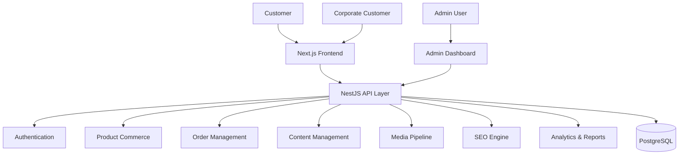
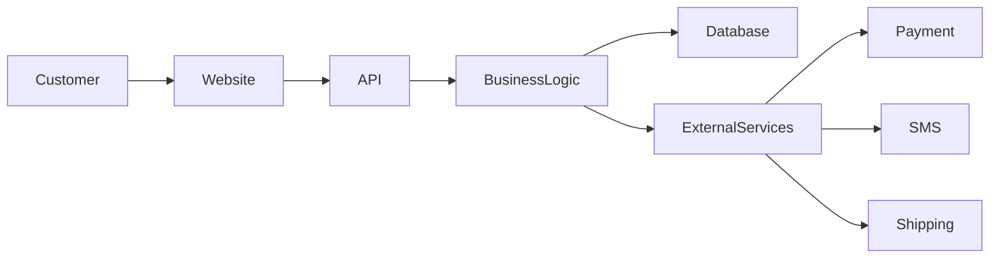
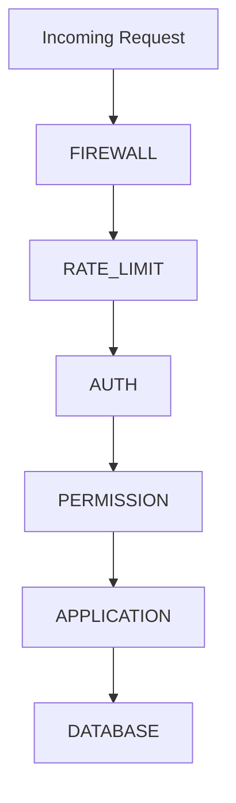
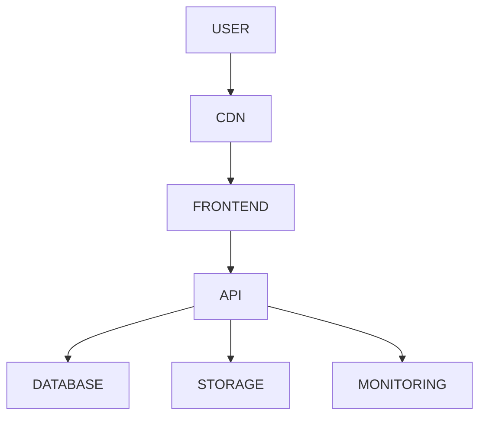

# SYSTEM ARCHITECTURE

> Project: Fardad Handicraft E-Commerce Platform

> Version: 1.0

> Status: Active

> Last Updated: 2026-07-19

> Owner: Software Architecture Team

---

# 1. Purpose

This document defines the complete high-level architecture of the Fardad platform.

The purpose is to create a scalable, maintainable, secure, and business-oriented digital commerce platform for luxury Persian handicraft products.

---

# 2. System Vision

Fardad is designed as a comprehensive handicraft commerce ecosystem.

The platform supports:

- Online product sales
- Corporate gifting
- Organization customers
- Product catalog
- Digital catalog management
- Customer accounts
- Order processing
- Payment
- Shipping
- Invoice generation
- Content marketing
- SEO
- Analytics
- Administration
- Business intelligence

---

# 3. Architecture Style

## Selected Architecture

Modular Monolith Architecture

---

## Reason

The platform requires:

- Strong module separation
- Fast development
- Low operational complexity
- Future scalability

---

## Future Evolution

If required, individual modules can later become independent services.

Potential candidates:

- Search Service
- Notification Service
- Media Service
- Analytics Service

---

# 4. High Level Architecture

---

# 5. Main System Modules

The platform consists of the following bounded modules.

---

# 5.1 Authentication Module

Responsibilities:

- User registration
- Login
- Password management
- Session management
- Role management
- Permission management

Users:

- Customer
- Corporate Customer
- Administrator
- Content Manager
- Sales Manager

---

# 5.2 Customer Module

Responsibilities:

- Customer profiles
- Addresses
- Order history
- Favorites
- Reviews
- Corporate information

---

# 5.3 Commerce Module

Responsibilities:

- Products
- Categories
- Attributes
- Variants
- Pricing
- Inventory
- Discounts

---

# 5.4 Order Module

Responsibilities:

- Cart
- Checkout
- Orders
- Payment status
- Shipping status
- Invoice generation

---

# 5.5 Corporate Sales Module

Responsibilities:

- Organization profiles
- Legal information
- Bulk orders
- Corporate invoices
- Sales communication

---

# 5.6 CMS Module

Responsibilities:

- Pages
- Articles
- Blog
- Landing pages
- Menus
- Content blocks

---

# 5.7 Media Module

Responsibilities:

- Image upload
- Optimization
- Conversion
- Storage
- Gallery management

---

# 5.8 SEO Module

Responsibilities:

- Metadata
- Sitemap
- Structured data
- Canonical URLs
- Internal linking

---

# 5.9 Notification Module

Responsibilities:

Channels:

- SMS
- Email
- Internal notification

Events:

- Registration
- Login verification
- Order creation
- Payment confirmation
- Shipping updates

---

# 5.10 Reporting Module

Responsibilities:

Business intelligence dashboard:

- Visitors
- Orders
- Revenue
- Products
- Inventory
- Customer behavior
- Content performance

---

# 6. Data Flow

---

# 7. External Integrations

The architecture supports:

## Payment

Provider Adapter Pattern

Examples:

- Iranian payment gateways

---

## SMS

Notification Adapter Pattern

Examples:

- SMS providers

---

## Shipping

Shipping Adapter Pattern

Examples:

- Iran Post
- Tipax
- Other providers

---

# 8. Security Architecture

Security layers:

---

# 9. Performance Architecture

Strategies:

- Server-side rendering
- Image optimization
- Database indexing
- Caching
- Pagination
- Lazy loading
- CDN readiness

---

# 10. SEO Architecture

SEO is integrated into every public module.

Requirements:

- Metadata generation
- Structured data
- Clean URLs
- Sitemap
- Performance optimization

---

# 11. Dashboard Architecture

Dashboard provides:

## Operational Metrics

- Orders
- Products
- Customers
- Inventory

## Marketing Metrics

- Page views
- Product views
- Search behavior

## Content Metrics

- Articles
- Images
- SEO performance

## System Metrics

- Errors
- Audit logs
- Performance

---

# 12. Deployment Architecture

---

# 13. Scalability Strategy

Current:

Modular Monolith

Future:

Selective service extraction.

Candidates:

- Search
- Media
- Notifications
- Reporting

---

# 14. Architecture Rules

Mandatory:

- Modules must remain isolated.
- Business logic must not exist in UI.
- External providers must use adapters.
- Every important action must be logged.
- Every public page must support SEO.

---

# 15. Architecture Success Criteria

Architecture is successful when:

- New features can be added without rewriting existing modules.
- Business rules remain clear.
- Performance remains stable.
- Security requirements are satisfied.
- Development can continue with multiple contributors.

---

# Action Items

- Use this document as the parent reference for all Blueprint chapters.
- Update when major architecture decisions change.
- Link new modules to this architecture document.
- Review before starting implementation milestones.