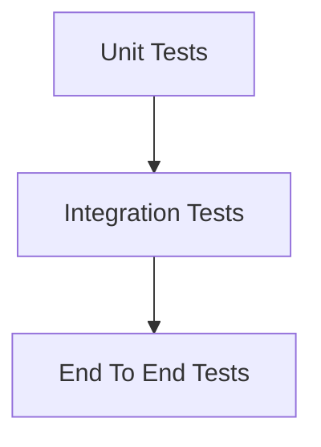
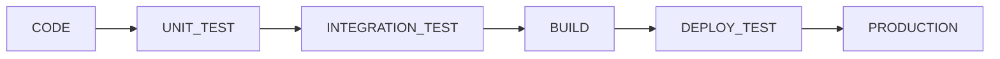

# TESTING STRATEGY

> Project: Fardad Handicraft E-Commerce Platform

> Version: 1.0

> Status: Active

> Last Updated: 2026-07-19

> Owner: Software Architecture Team

---

# 1. Purpose

This document defines the testing strategy for the Fardad platform.

The objective is to ensure:

- Software reliability
- Business correctness
- Security
- Performance
- Stable releases

---

# 2. Testing Principles

The platform follows:

- Test early
- Automate repetitive tests
- Protect critical business flows
- Test before production deployment
- Maintain regression coverage

---

# 3. Testing Pyramid



---

# 4. Testing Levels

The system requires:

```
Unit Testing

Integration Testing

API Testing

UI Testing

End-to-End Testing

Security Testing

Performance Testing

```

---

# 5. Unit Testing

Purpose:

Test isolated business logic.

Examples:

- Price calculation
- Discount calculation
- Shipping calculation
- Invoice calculation
- Permission validation

---

# 6. Integration Testing

Purpose:

Verify communication between modules.

Examples:

- Order + Payment
- Product + Inventory
- Customer + Invoice
- Media + Product

---

# 7. API Testing

All APIs require testing.

Tests:

- Request validation
- Response format
- Authentication
- Authorization
- Error handling

---

Example:

```
GET /products

POST /orders

POST /payment/verify

```

---

# 8. Frontend Testing

Frontend tests cover:

## Components

Examples:

- Product Card
- Gallery
- Cart Button
- Forms


## User Interaction

Examples:

- Add to cart
- Search
- Checkout navigation

---

# 9. End-to-End Testing

Critical customer journey:


---

# 10. Product Testing

Required tests:

- Product creation
- Product editing
- Product publishing
- Image assignment
- Inventory update
- Price changes

---

# 11. Cart Testing

Verify:

- Add product
- Remove product
- Change quantity
- Calculate total
- Apply discount

---

# 12. Checkout Testing

Test:

- Customer information
- Address selection
- Shipping calculation
- Payment selection
- Order confirmation

---

# 13. Payment Testing

Required:

- Successful payment
- Failed payment
- Cancelled payment
- Callback verification
- Duplicate callback handling

---

# 14. Shipping Testing

Required:

- Address validation
- Shipping cost calculation
- Shipping provider integration
- Tracking status

---

# 15. Corporate Customer Testing

Test:

- Company registration
- Verification workflow
- Legal information
- Corporate order
- Official invoice generation

---

# 16. Invoice Testing

Verify:

- Customer information
- Company information
- Tax fields
- Product details
- Final amount
- PDF generation

---

# 17. Dashboard Testing

Test:

- Statistics accuracy
- Filters
- Date ranges
- Reports
- Export functions

---

# 18. Media Testing

Verify:

- Image upload
- Image processing
- Thumbnail generation
- WebP conversion
- Gallery management

---

# 19. SEO Testing

Required:

- Metadata generation
- Sitemap generation
- Structured data
- Canonical URLs
- Robots rules

---

# 20. Security Testing

Tests:

## Authentication

- Login
- Logout
- Password reset


## Authorization

- Permission checks
- Role restrictions


## Input Security

- XSS prevention
- Injection prevention


## File Security

- Upload restrictions

---

# 21. Performance Testing

Test:

- Page loading speed
- API response time
- Database performance
- Image loading
- Concurrent users

---

# 22. Load Testing Scenarios

Important scenarios:

## Product browsing

Many visitors viewing products.


## Checkout

Multiple simultaneous orders.


## Dashboard

Large reporting queries.

---

# 23. Regression Testing

Every release must verify:

- Existing features still work.
- Previous bugs remain fixed.
- Core shopping flow works.

---

# 24. Automated Testing Pipeline



---

# 25. Test Data Strategy

Use:

- Development data
- Staging data
- Mock payment gateway
- Sample products

Never use real customer data in tests.

---

# 26. Bug Management

Every bug requires:

```
ID

Description

Priority

Severity

Steps

Expected Result

Actual Result

Status

```

---

# 27. Test Environment

Required:

Development:

Developer testing


Staging:

QA testing


Production:

Monitoring only

---

# 28. Release Testing Checklist

Before release:

## Application

☐ Unit tests passed

☐ Integration tests passed

☐ Critical flows tested


## Business

☐ Purchase flow tested

☐ Payment tested

☐ Invoice tested


## Technical

☐ Performance checked

☐ Security checked

---

# 29. Quality Gates

A release cannot proceed if:

- Critical bugs exist.
- Security tests fail.
- Payment flow fails.
- Database migration fails.

---

# 30. Future Testing Improvements

Possible additions:

- AI-assisted testing
- Visual regression testing
- Automated accessibility testing
- Continuous security scanning

---

# Action Items

- Maintain automated test coverage.
- Test critical business flows before deployment.
- Update tests when features change.
- Keep staging environment synchronized.
- Link test results to Work Orders.